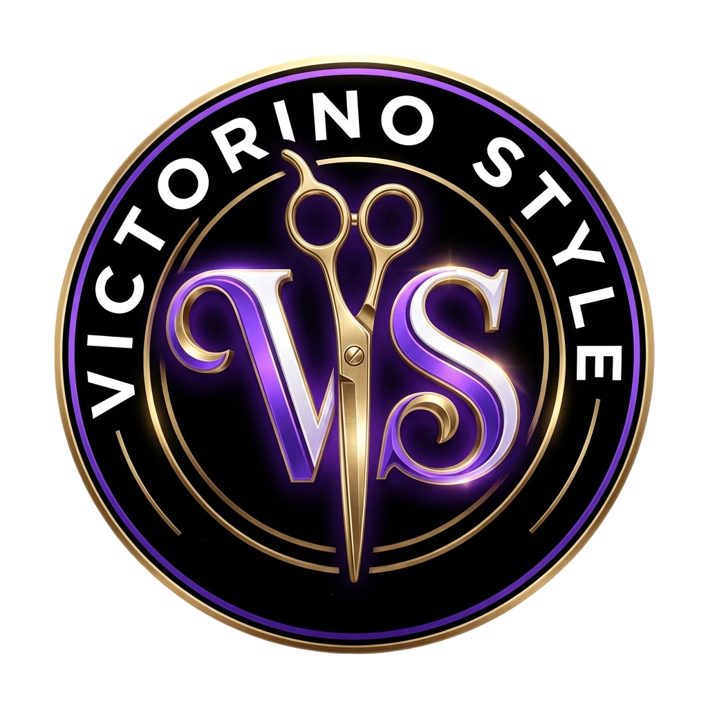
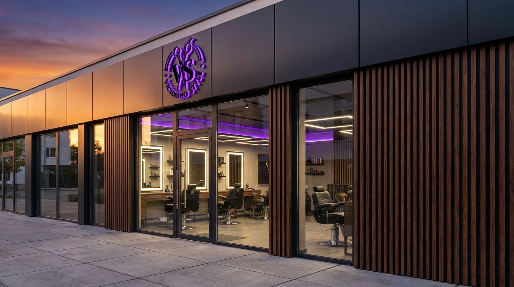
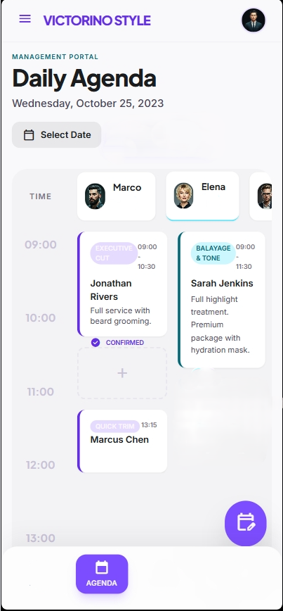
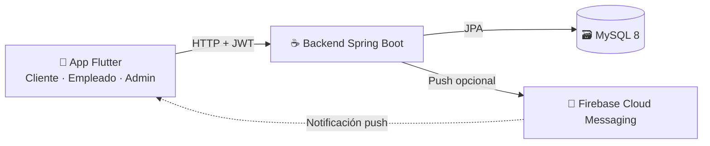
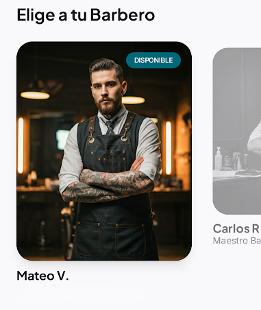

# Victorino Style

### Reserva tu cita en menos tiempo del que tardas en pedir un café. ☕

<!--
  IMAGEN H2 (hero / mockup principal)
  Sugerencia: un único mockup tipo "iPhone / Pixel" mostrando el Home del cliente
  con la card de "Tu próxima cita" visible (la del gradiente púrpura-cian).
  Idealmente exportado desde el emulador o desde Figma.
  Coloca el archivo en: documentacion/imagenes_readme/hero_mockup.png
  y descomenta la línea siguiente:
-->
<!--  -->

---

> **Tu peluquería, abierta 24/7.**
> Reserva, modifica o cancela tu cita desde el sofá. Sin llamadas. Sin esperas. Sin esfuerzo.

---

## ✨ ¿Qué es Victorino Style?

Una app multiplataforma — **Android, iOS y web** — que digitaliza por completo la experiencia de una peluquería: desde que el cliente reserva hasta que el peluquero confirma que ha terminado el servicio.

No es solo "una app de citas". Es el **sistema operativo completo del negocio**: catálogo de servicios, plantilla, agenda en tiempo real, métricas, notificaciones y todo lo necesario para que la peluquería deje de gestionarse a mano.

<!--
  IMAGEN H3 (foto real del local)
  Sugerencia: la foto del interior que ya existe.
  Archivo: frontend_victorino/assets/imagenes/local_por_dentro.png
-->

---

## 🎯 El problema → 💡 La solución

| Antes | Con Victorino Style |
|---|---|
| 📞 Llamar y rezar para que cojan el teléfono | 📱 Reserva en 30 segundos desde el móvil |
| ❓ Sin saber qué huecos hay disponibles | 📅 Calendario en tiempo real, siempre actualizado |
| 😬 Olvidarte de la cita y faltar | 🔔 Recordatorio automático 24 horas antes |
| 🧾 La peluquería gestionando todo a papel | 📊 Dashboard con métricas en tiempo real |

---

## 📱 Tres apps, una sola solución

<table>
<tr>
<td align="center" width="33%">

### 👤 Cliente
**Reserva sin fricción**

Wizard de 4 pasos guiados, próxima cita siempre visible, historial completo y notificaciones inteligentes.

<!--
  IMAGEN H5a (mockup del cliente)
  Sugerencia: captura del Home del cliente con la card "Mi próxima cita" visible.
  Archivo nuevo: documentacion/imagenes_readme/mockup_cliente.png
-->
<!--  -->

</td>
<td align="center" width="33%">

### ✂️ Empleado
**Su agenda al día**

Citas del día, walk-ins instantáneos para clientes presenciales y estados de cita en tiempo real.

<!--
  IMAGEN H5b (mockup del empleado)
  Sugerencia: agenda diaria del empleado con citas marcadas.
  Archivo nuevo: documentacion/imagenes_readme/mockup_empleado.png
-->
<!--  -->

</td>
<td align="center" width="33%">

### ⚙️ Administrador
**El control total**

Catálogo, plantilla, horarios, festivos y métricas: todo lo que el dueño necesita para tomar decisiones.

</td>
</tr>
</table>

---

## 🚀 Funcionalidades estrella

<table>
<tr>
<td width="33%">

### 🪄 Wizard 4 pasos
Servicio · Peluquero · Día y hora · Confirmar. Reserva en menos de 30 segundos.

</td>
<td width="33%">

### 🔔 Notificaciones inteligentes
Confirmación al instante, recordatorio 24 h antes, bandeja in-app + push opcional.

</td>
<td width="33%">

### 📅 Calendario consciente
Festivos, cierre anual y descansos. Si está cerrada, no te deja reservar.

</td>
</tr>
<tr>
<td width="33%">

### 🛡️ Roles con permisos
Cliente, empleado y administrador con vistas y acciones específicas, controlados por JWT.

</td>
<td width="33%">

### 📊 Métricas en tiempo real
Asistencia, servicio más solicitado, empleado más reservado, franja horaria estrella.

</td>
<td width="33%">

### 🔒 RGPD by design
Anonimización al borrar cuenta, contraseñas BCrypt, tokens firmados, datos cifrados.

</td>
</tr>
</table>

---

## 🏗️ Cómo funciona por dentro

**Arquitectura cliente-servidor de 3 capas** + Firebase para notificaciones. 
Frontend Flutter consume la API REST del backend Java; el backend persiste en MySQL y dispara push vía Firebase cuando hay novedades.

---

## 🛠️ Stack técnico

| Capa | Tecnologías |
|---|---|
| **Móvil / Web** | Flutter 3.41 · Dart 3.11 · Riverpod · GoRouter · Dio |
| **Backend** | Spring Boot 4 · JDK 21 · Spring Data JPA · Spring Security · jjwt |
| **Base de datos** | MySQL 8 · 15 tablas · InnoDB · Locks pesimistas + optimistas |
| **Notificaciones** | Firebase Cloud Messaging |
| **Diseño** | Material 3 · Poppins (titulares) + Roboto (cuerpo) · Púrpura `#7C4DFF` |
| **Testing** | JUnit 5 · Mockito · Flutter Test |

---

## 📸 Vista previa

<!--
  IMAGEN H7 (galería demo, 3 imágenes side-by-side)
  Sugerencia: tres capturas del wizard del cliente puestas en fila.
    1) Paso 2 (elegir peluquero) — ya existe parcialmente como mockup en
       frontend_victorino/prototipo_de_interfaces/cliente_reservar_elegir_peluquero.png
    2) Paso 3 (día y hora) — ya existe parcialmente como mockup en
       frontend_victorino/prototipo_de_interfaces/cliente_reservar_seleccionar fecha_hora.png
    3) Home con próxima cita activa — NUEVO, capturar del emulador.
       documentacion/imagenes_readme/home_proxima_cita.png
-->

<!--  -->

---

## 🌟 Roadmap

- ☑ MVP con los 3 módulos (cliente, empleado, administrador)
- ☑ Wizard de reserva en 4 pasos guiados
- ☑ Notificaciones push (Firebase Cloud Messaging) + recordatorio 24 h
- ☑ Métricas en tiempo real del negocio
- ☑ Cumplimiento RGPD con anonimización por soft-delete
- ☐ Pagos integrados (Stripe / Redsys)
- ☐ Programa de fidelización por puntos
- ☐ Sugerencia de corte con IA a partir de selfie
- ☐ Multi-tenant: una sola instancia para varias peluquerías
- ☐ Intercambio de turnos entre empleados

---

### Hecho con ♥ para que reservar una cita sea **tan simple como un swipe**.

