

# Victorino Style

### Reserva tu cita en menos tiempo del que tardas en pedir un café. ☕

<!--
  IMAGEN H2 (hero / mockup principal)
  Sugerencia: un único mockup tipo "iPhone / Pixel" mostrando el Home del cliente
  con la card de "Tu próxima cita" visible (la del gradiente púrpura-cian).
  Idealmente exportado desde el emulador o desde Figma.
  Coloca el archivo en: documentacion/imagenes_readme/hero_mockup.png
  y descomenta la línea siguiente:
-->
<!--  -->

---

> **Tu peluquería, abierta 24/7.**
> Reserva, modifica o cancela tu cita desde el sofá. Sin llamadas. Sin esperas. Sin esfuerzo.

---

## ✨ ¿Qué es Victorino Style?

Una app multiplataforma — **Android, iOS, Linux, Windows y web** — que digitaliza por completo la experiencia de una peluquería: desde que el cliente reserva hasta que el peluquero confirma que ha terminado el servicio.

No es solo "una app de citas". Es el **sistema operativo completo del negocio**: catálogo de servicios, plantilla, agenda en tiempo real, métricas, notificaciones y todo lo necesario para que la peluquería deje de gestionarse a mano.

Cuenta con 3 roles: Administrador, Empleado y Cliente.

Landing del proyecto: https://landing-victorino-style.up.railway.app/
---

## 🎯 El problema → 💡 La solución

| Antes | Con Victorino Style |
|---|---|
| 📞 Llamar y rezar para que cojan el teléfono | 📱 Reserva en 30 segundos desde el móvil |
| ❓ Sin saber qué huecos hay disponibles | 📅 Calendario en tiempo real, siempre actualizado |
| 😬 Olvidarte de la cita y faltar | 🔔 Recordatorio automático 24 horas antes |
| 🧾 La peluquería gestionando todo a papel | 📊 Dashboard con métricas en tiempo real |

---

## 📱 Tres apps, una sola solución

<table>
<tr>
<td align="center" width="33%">

### 👤 Cliente
**Reserva sin fricción**

Wizard de 4 pasos guiados, próxima cita siempre visible, historial completo y notificaciones inteligentes.

<!--
  IMAGEN H5a (mockup del cliente)
  Sugerencia: captura del Home del cliente con la card "Mi próxima cita" visible.
-->
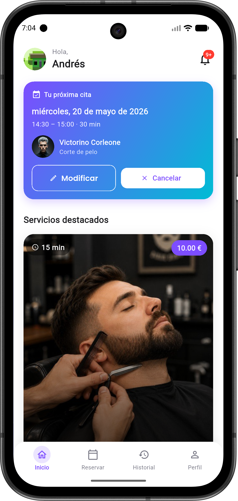

</td>
<td align="center" width="33%">

### ✂️ Empleado
**Su agenda al día**

Citas del día con estado en tiempo real, walk-ins instantáneos para clientes presenciales y perfil personalizable.

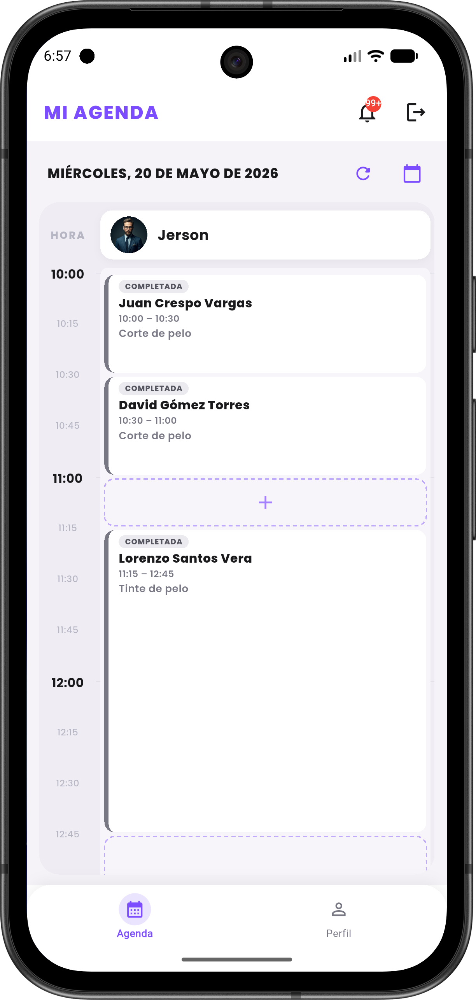

</td>
<td align="center" width="33%">

### ⚙️ Administrador
**El control total**

Catálogo, plantilla, horarios, festivos y métricas: todo lo que el dueño necesita para tomar decisiones.

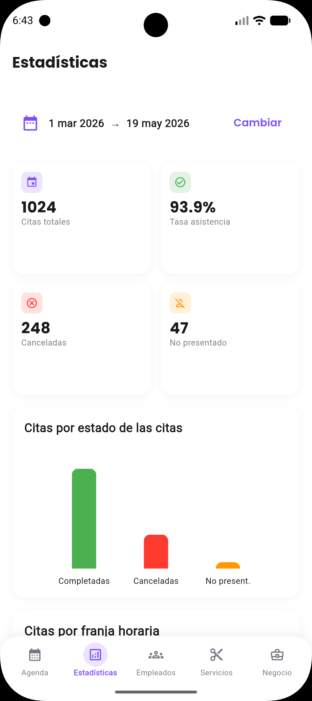

</td>
</tr>
</table>

---

## 🚀 Funcionalidades estrella

<table>
<tr>
<td width="33%">

###  ✨ Wizard 4 pasos
Servicio · Peluquero · Día y hora · Confirmar. Reserva en menos de 30 segundos.

</td>
<td width="33%">

### 🔔 Notificaciones inteligentes
Confirmación al instante, recordatorio 24 h antes, bandeja in-app + push opcional.

</td>
<td width="33%">

### 📅 Calendario consciente
Festivos, cierre anual y descansos. Si está cerrada, no te deja reservar.

</td>
</tr>
<tr>
<td width="33%">

### 🛡️ Roles con permisos
Cliente, empleado y administrador con vistas y acciones específicas, controlados por JWT.

</td>
<td width="33%">

### 📊 Métricas en tiempo real
Asistencia, servicio más solicitado, empleado más reservado, franja horaria estrella.

</td>
<td width="33%">

### 🔒 RGPD by design
Anonimización al borrar cuenta, contraseñas BCrypt, tokens firmados, datos cifrados.

</td>
</tr>
</table>

---

## 🏗️ Cómo funciona por dentro

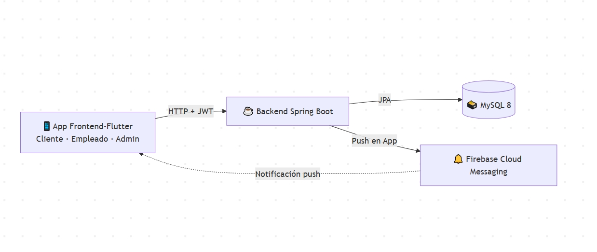

**Arquitectura cliente-servidor de 3 capas** + Firebase para notificaciones.
Frontend-Flutter consume la API REST del backend Java; el backend persiste en MySQL y dispara push vía Firebase cuando hay novedades.

---

## 🛠️ Stack técnico

| Capa | Tecnologías |
|---|---|
| **Móvil / Web** | Flutter 3.41 · Dart 3.11 · Riverpod · GoRouter · Dio |
| **Backend** | Spring Boot 4 · JDK 21 · Spring Data JPA · Spring Security · jjwt |
| **Base de datos** | MySQL 8 · 15 tablas · InnoDB · Locks pesimistas + optimistas |
| **Notificaciones** | Firebase Cloud Messaging |
| **Diseño** | Material 3 · Poppins (titulares) + Roboto (cuerpo) · Púrpura `#7C4DFF` |
| **Testing** | JUnit 5 · Mockito · Flutter Test |

---

## 📸 Wizard del cliente: paso a paso para reservar una cita

> Reservar una cita es **literalmente** desplazar el dedo cuatro veces.

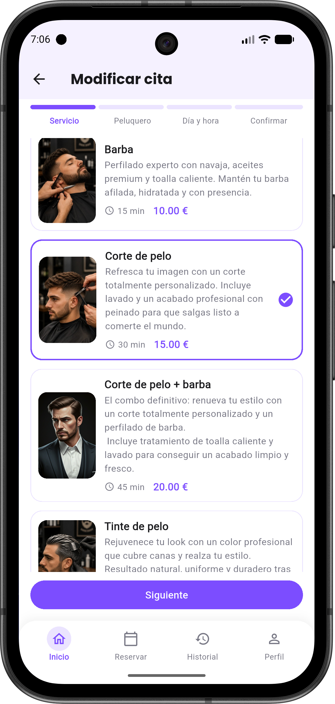
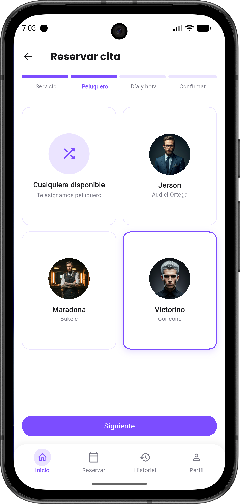
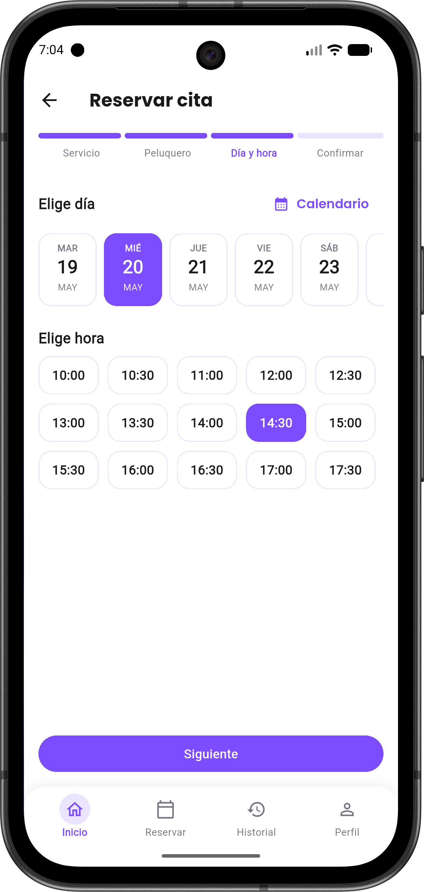
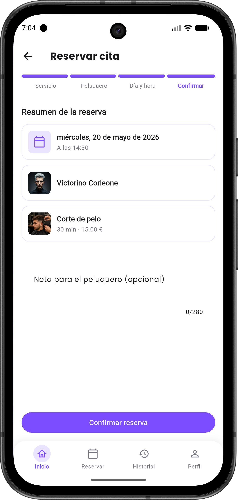

---

## 🧑‍💼 Para los profesionales

<table>
<tr>
<td align="center">
  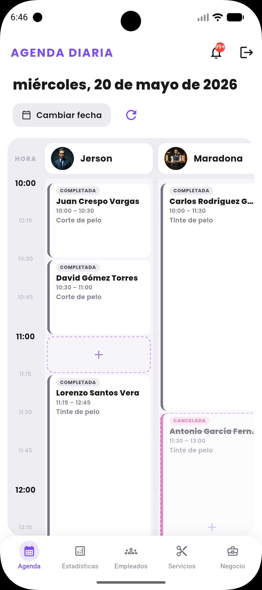
   <b>Agenda global del admin</b>
</td>
<td align="center">
  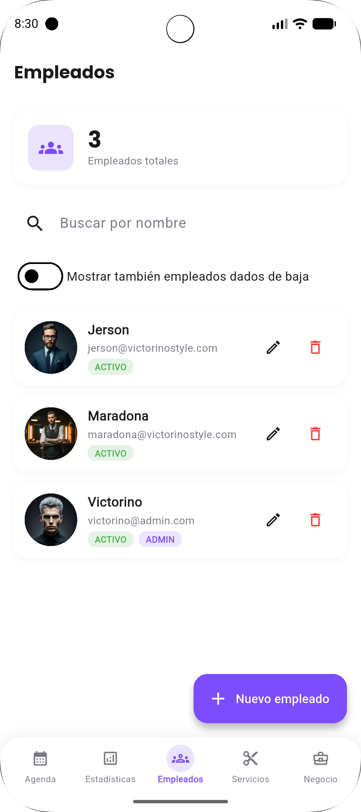
   <b>Gestión de la plantilla de empleados</b>
</td>
<td align="center">
  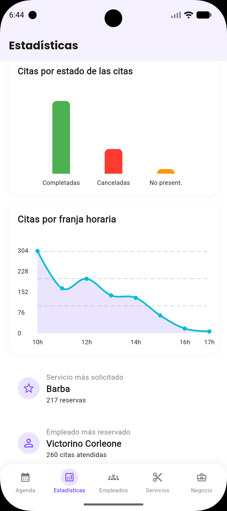
   <b>Dashboard de métricas</b>
</td>

</tr>
</table>

---

## 🌟 Roadmap

- ☑ MVP con los 3 módulos (cliente, empleado, administrador).
- ☑ Wizard de reserva en 4 pasos guiados.
- ☑ Notificaciones push (Firebase Cloud Messaging) + recordatorio 24 h.
- ☑ Métricas en tiempo real del negocio.
- ☑ Cumplimiento RGPD con anonimización por soft-delete.
- ☐ Pagos integrados (Stripe / Redsys).
- ☐ Programa de fidelización por puntos.
- ☐ Sugerencia de corte con IA a partir de selfie.
- ☐ Multi-tenant: una sola instancia para varias peluquerías.
- ☐ Intercambio de turnos entre empleados.
- ☐ Envío de notificaciones por correo electrónico.
- ☐ Sistema de reseñas para que los clientes valoren su experiencia.
- ☐ Gestión de inventario con métricas detalladas de ingresos y gastos.
- ☐ Modo oscuro y selector de idioma para personalizar la interfaz.

---
## 👨‍💻 Sobre mí

Soy un desarrollador con enfoque en **resolver problemas reales a través de la tecnología**.

¡Conectemos!

---

> *"La tecnología no sirve de nada si no ahorra tiempo y esfuerzo a las personas que la utilizan."*

### Hecho con ♥ para que reservar una cita sea tan simple como un swipe. 
 Tu mejor versión empieza aquí con Victorino Style.

