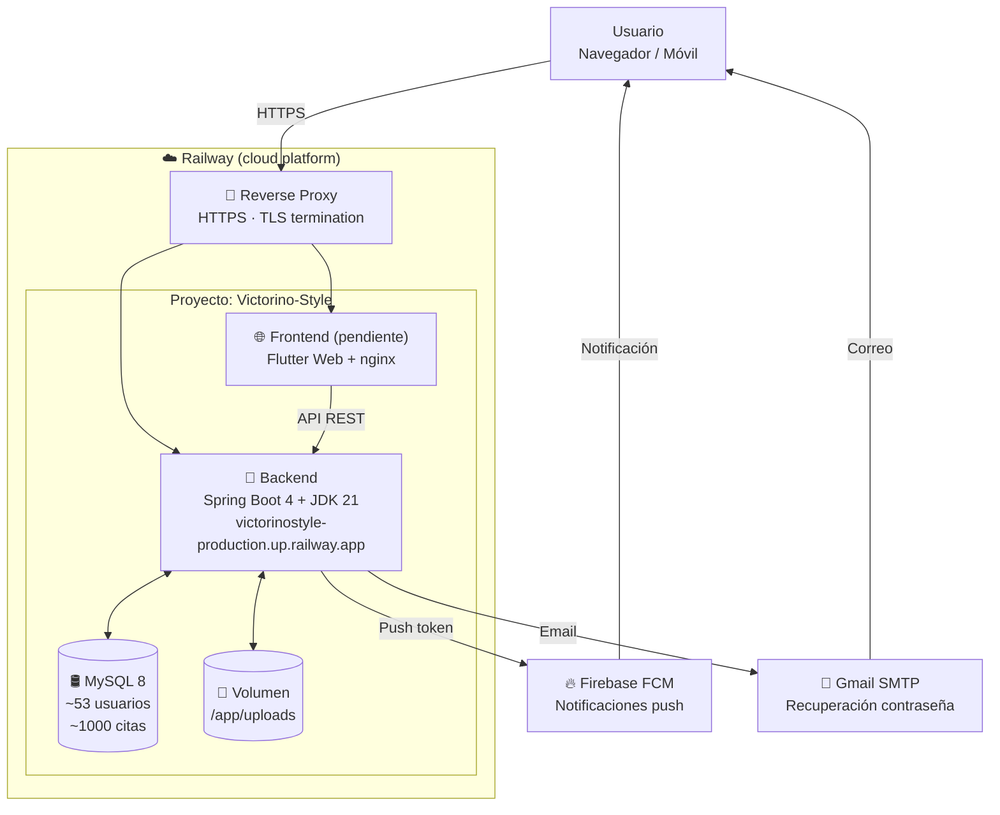
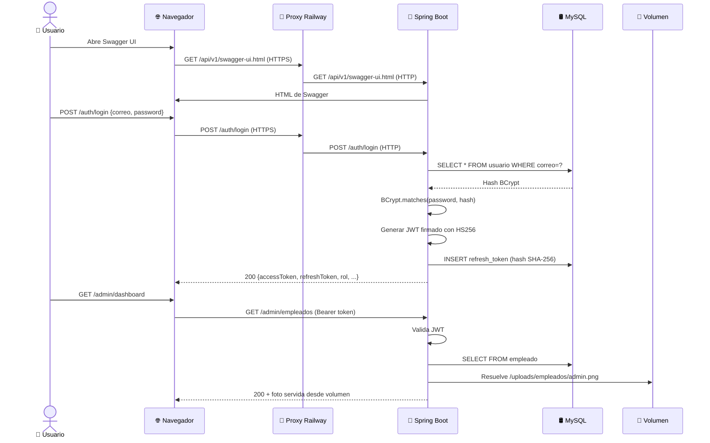

# Guía de despliegue a producción — Victorino Style

> **Autor**: Kevin (KevinFlow-ai)
> **Proyecto**: TFG 2DAM, curso 2025/2026
> **Fecha del despliegue**: mayo de 2026
> **Plataforma**: Railway
> **Backend público**: `https://victorinostyle-production.up.railway.app/api/v1`
> **Frontend público**: *(pendiente, se completará en la siguiente fase)*

---

## Índice

1. [Resumen ejecutivo](#1-resumen-ejecutivo)
2. [Conceptos previos](#2-conceptos-previos-explicados-en-cristiano)
3. [Arquitectura final desplegada](#3-arquitectura-final-desplegada)
4. [Stack tecnológico](#4-stack-tecnológico)
5. [Preparación del proyecto antes de desplegar](#5-preparación-del-proyecto-antes-de-desplegar)
6. [Paso a paso del despliegue en Railway](#6-paso-a-paso-del-despliegue-en-railway)
7. [Errores reales que aparecieron y cómo se resolvieron](#7-errores-reales-que-aparecieron-y-cómo-se-resolvieron)
8. [Verificación y pruebas](#8-verificación-y-pruebas)
9. [Frontend Flutter Web (pendiente)](#9-frontend-flutter-web-pendiente)
10. [APK Android (pendiente)](#10-apk-android-pendiente)
11. [Preguntas frecuentes (FAQ para el tribunal)](#11-preguntas-frecuentes-faq-para-el-tribunal)
12. [Anexo A — Variables de entorno completas](#12-anexo-a--variables-de-entorno-completas)
13. [Anexo B — Comandos útiles](#13-anexo-b--comandos-útiles)
14. [Anexo C — Glosario de términos](#14-anexo-c--glosario-de-términos)

---

## 1. Resumen ejecutivo

Victorino Style nació como una aplicación que se ejecutaba **únicamente en mi máquina local**: el backend en `localhost:8080`, la base de datos MySQL en `localhost:3306` y el frontend Flutter accediendo a la IP local del ordenador. Esto funciona para desarrollo, pero **no sirve para que el tribunal, mis compañeros o un cliente real puedan probar la aplicación desde su propio dispositivo sin tener mi ordenador encendido**.

El objetivo del despliegue ha sido **convertir esa aplicación local en un servicio accesible 24/7 desde Internet**, de forma que cualquier persona en cualquier lugar pueda usarla:

- Desde un **navegador web** (la versión Flutter Web).
- Desde un **móvil Android** (instalando un APK que se conecta al backend en la nube).

Para conseguir esto se ha utilizado **Railway**, una plataforma en la nube (PaaS) que aloja:

1. El **backend** Spring Boot compilado y arrancado automáticamente desde mi repositorio de GitHub.
2. Una **base de datos MySQL** gestionada que sustituye al MySQL local de mi máquina.
3. Un **volumen persistente** donde se guardan las fotos subidas por los usuarios (sin perderse al redesplegar).
4. *(Pendiente)* Un segundo servicio para el **frontend Flutter Web** que servirá la aplicación a través de una URL pública.

Además, dos servicios externos se siguen utilizando tal cual estaban en local:

- **Firebase Cloud Messaging** para las notificaciones push al móvil.
- **Gmail SMTP** para el envío del código de recuperación de contraseña por correo.

Todo el proceso se ha hecho cuidando dos aspectos clave:

- **Seguridad**: ninguna contraseña, ninguna clave privada, ningún token aparece "a pelo" en el código del repositorio. Todos los secretos se inyectan como **variables de entorno** desde Railway, no desde el código.
- **Reproducibilidad**: si mañana hay que volver a desplegar todo desde cero (por desastre, por cambio de proveedor, o para crear un entorno de pruebas paralelo), basta con seguir esta guía y los archivos del repositorio. No depende de "cosas que solo Kevin sabe".

---

## 2. Conceptos previos (explicados en cristiano)

Antes de entrar en el cómo, conviene entender el qué y el porqué. Esta sección está pensada para que cualquier persona —sin conocimientos técnicos profundos— pueda seguir la guía y entender las decisiones tomadas.

### 2.1. ¿Qué significa "desplegar a producción"?

Hasta ahora, la aplicación corría en mi ordenador. Si yo apagaba el portátil, la aplicación dejaba de existir. **Desplegar a producción** significa coger esa misma aplicación y meterla en un servidor que vive en Internet, encendido permanentemente, accesible desde cualquier dispositivo del mundo a través de una URL pública.

Es exactamente la misma diferencia que hay entre tener un documento en tu portátil y subirlo a Google Drive: en el primer caso solo lo ves tú, en el segundo lo ve cualquiera con el enlace.

### 2.2. ¿Qué es Railway?

Railway es una **plataforma como servicio (PaaS, *Platform as a Service*)**. Eso quiere decir que tú le entregas el código fuente de tu aplicación y la plataforma se encarga del resto:

- Te da una máquina virtual en algún centro de datos.
- Instala las dependencias (en mi caso JDK 21, Maven, MySQL).
- Compila tu código.
- Arranca tu aplicación.
- Le pone delante un *reverse proxy* con HTTPS automático.
- Te da una URL pública.
- Si tu aplicación se cae, intenta reiniciarla automáticamente.

Compárese con la alternativa de **IaaS (*Infrastructure as a Service*)** como AWS EC2 o un VPS en DigitalOcean: ahí te dan una máquina vacía con Linux y tú tienes que instalar todo a mano (Java, MySQL, Nginx, certificados Let's Encrypt, systemd, etc.). Railway abstrae todo eso.

### 2.3. ¿Por qué Railway y no AWS, Heroku, Render u otra?

| Plataforma | Pros | Contras |
|---|---|---|
| **Railway** ✅ | Setup sencillísimo, MySQL integrado, plan gratuito generoso para TFG, deploys automáticos desde GitHub, UI muy clara | Plataforma joven (más riesgo a largo plazo) |
| AWS / GCP / Azure | El estándar profesional, escalan infinitamente | Curva de aprendizaje muy alta, configurar mil servicios, factura difícil de estimar |
| Heroku | Pionero del PaaS, muy maduro | Sin plan gratuito real desde 2022, más caro |
| Render | Similar a Railway | Algo menos pulido en su UI |
| Vercel / Netlify | Excelentes para frontend estático | No están pensados para backend Spring Boot |

Para un TFG donde importa **demostrar conocimiento del concepto del despliegue, no perderse en configuración de infraestructura**, Railway es la opción equilibrada: profesional pero abordable.

### 2.4. ¿Qué es un contenedor? ¿Qué es Docker?

Un **contenedor** es como una "caja" que empaqueta tu aplicación junto con todo lo que necesita para funcionar (sistema operativo mínimo, librerías, runtime, configuración). La idea: si funciona en mi contenedor, funcionará exactamente igual en cualquier otro sitio donde se ejecute ese contenedor.

**Docker** es la tecnología más usada para crear y ejecutar contenedores. Railway internamente usa contenedores Docker para arrancar tu aplicación, aunque te abstrae tanto que muchas veces ni te enteras.

En este proyecto, el **frontend** sí usa un `Dockerfile` propio (porque Flutter Web necesita un proceso de build especial). El **backend** no necesita Dockerfile porque Railway lo detecta y construye automáticamente con un sistema llamado *Nixpacks*.

### 2.5. ¿Qué es Nixpacks?

Es el sistema "mágico" que usa Railway por defecto. Tú le subes tu proyecto, Nixpacks mira los ficheros (`pom.xml` para Java, `package.json` para Node, etc.) y deduce cómo compilarlo y arrancarlo. Para el backend Spring Boot detecta el `pom.xml`, instala Maven y un JDK, lanza `./mvnw install` y luego ejecuta el JAR resultante.

### 2.6. ¿Qué es un volumen persistente y por qué importa?

Un contenedor es **efímero**: cuando se reinicia (porque hay un nuevo despliegue, porque la máquina se mueve, etc.), todo su sistema de archivos se pierde y se vuelve a partir de cero desde la imagen original. Eso es genial para la aplicación (siempre arranca limpia), pero **un problema gordísimo si tu app guarda archivos en disco** (como las fotos que suben los usuarios).

Un **volumen persistente** es un disco externo que vive fuera del contenedor y se monta en una ruta concreta. Si el contenedor se reinicia, el volumen sigue ahí intacto. En este proyecto se ha creado un volumen montado en `/app/uploads` para que las fotos de servicios, empleados y clientes no se pierdan.

### 2.7. ¿Qué es un reverse proxy y la "terminación TLS"?

Cuando tu navegador llama a `https://victorinostyle-production.up.railway.app`, esa petición **no llega directa al backend Spring Boot**. Railway tiene un **reverse proxy** (un servidor intermedio) que:

1. Recibe la petición HTTPS de tu navegador.
2. Descifra el contenido (a esto se le llama **terminación TLS**).
3. Le pasa la petición a tu backend Spring Boot, ya en HTTP plano dentro de la red interna de Railway.
4. Recibe la respuesta del backend.
5. La cifra de nuevo en HTTPS y la devuelve al navegador.

```
Navegador  ───HTTPS───►  Reverse Proxy Railway  ───HTTP───►  Backend Spring Boot
           ◄──HTTPS────                          ◄──HTTP────
```

Ventaja: tu backend no tiene que ocuparse de certificados SSL ni renovaciones. Inconveniente: el backend "ve" la petición como HTTP, no HTTPS, lo que dio un problema en Swagger UI que se resolvió con `server.forward-headers-strategy=framework` (ver sección de errores).

### 2.8. ¿Qué son las variables de entorno y por qué son tan importantes?

Una **variable de entorno** es un parámetro que se le pasa a la aplicación cuando arranca, sin estar escrito en el código. Por ejemplo:

```properties
spring.datasource.password=${SPRING_DATASOURCE_PASSWORD:1234}
```

Eso significa: "la contraseña de la base de datos es el valor de la variable de entorno `SPRING_DATASOURCE_PASSWORD`, y si no existe, usa `1234` como valor por defecto".

¿Por qué se hace así?

1. **Seguridad**: si la contraseña real estuviera en el código, cualquiera con acceso al repositorio podría verla. Como está en una variable, solo Railway la conoce.
2. **Portabilidad**: en local uso `1234`, en Railway uso una contraseña aleatoria fuerte. El mismo código sirve para ambos entornos sin tocar nada.
3. **Rotación**: si mañana se compromete la contraseña, la cambio en Railway sin tener que hacer un nuevo commit del código.

### 2.9. ¿Qué es JWT?

**JWT (JSON Web Token)** es un estándar para emitir tokens de autenticación. Cuando el usuario hace login, el backend le devuelve un *access token* (JWT) y un *refresh token*. El cliente envía el access token en cada petición posterior (`Authorization: Bearer <token>`) y el backend lo valida para saber qué usuario es.

Características clave:
- **Stateless**: el backend no guarda sesiones en memoria, todo está autocontenido en el token.
- **Firmado con HS256**: el token lleva una firma digital generada con una clave secreta (`VICTORINO_JWT_SECRET`). Si alguien intenta modificar el token, la firma deja de cuadrar y el backend lo rechaza.
- **Expira en 15 minutos**: si te roban el access token, solo es válido 15 min. El refresh token (válido 7 días) se usa para pedir uno nuevo sin volver a meter contraseña.

### 2.10. ¿Qué es BCrypt?

Es el algoritmo que se usa para guardar las contraseñas en la base de datos. **Nunca se guarda la contraseña en texto plano**: se guarda un *hash* (una transformación irreversible) generado por BCrypt con un "cost factor" de 10. Cuando el usuario hace login, se compara el hash de su contraseña intentada con el hash guardado.

Ventajas frente a SHA-256 / MD5:
- **Lento a propósito**: tarda ~100ms en generar un hash, lo que dificulta los ataques por fuerza bruta.
- **Salt automático**: cada hash incluye un valor aleatorio único, así dos usuarios con la misma contraseña tienen hashes distintos.

---

## 3. Arquitectura final desplegada

### 3.1. Visión general




### 3.2. Cómo conviven los servicios

- **Backend** y **MySQL** viven dentro de la misma red privada de Railway. El backend se conecta al MySQL por nombre interno (`mysql.railway.internal`), sin pasar por Internet. Esto es **rápido** (latencia <1ms) y **seguro** (nadie de fuera puede llegar al MySQL salvo que abramos un *TCP Proxy* público, cosa que hicimos puntualmente para cargar los datos iniciales y se puede cerrar después).
- El **volumen** se monta en el sistema de archivos del backend en `/app/uploads`. Para el backend es indistinguible de una carpeta local, pero realmente vive en un disco aparte que sobrevive a los redespliegues.
- Las **variables de entorno** del backend incluyen referencias a las del MySQL (`${{MySQL.MYSQLHOST}}`). Railway las resuelve automáticamente en tiempo de arranque.

---

## 4. Stack tecnológico

| Componente | Tecnología | Versión | Por qué |
|---|---|---|---|
| Plataforma cloud | Railway | — | PaaS sencillo, plan Hobby asumible, integración GitHub |
| Lenguaje backend | Java | 21 (Temurin) | LTS más reciente, requerido por Spring Boot 4 |
| Framework backend | Spring Boot | 4.0.6 | Madurez, ecosistema, Spring Security |
| Gestor de dependencias | Maven | (vía mvnw) | Estándar Java, lock automático |
| Base de datos | MySQL | 8.0 | Relacional, ACID, lo que pedía el TFG |
| ORM | Hibernate (vía JPA) | — | Mapeo objeto-relacional, productividad |
| Autenticación | JWT (jjwt 0.13) | — | Stateless, escalable |
| Documentación API | Springdoc OpenAPI | 3.0.1 | Swagger UI gratis y autogenerado |
| Notificaciones push | Firebase Admin SDK | 9.8.0 | Soporta Android/iOS/Web con un solo SDK |
| Correo | Spring Mail + Gmail SMTP | — | Cero coste para volúmenes bajos |
| Compilación frontend | Flutter | 3.41.2 | Multi-plataforma desde un único código |
| Servidor frontend | nginx alpine | — | Ligero, sirve estáticos perfectamente |
| Empaquetado frontend | Docker | — | Reproducibilidad del build |

---

## 5. Preparación del proyecto antes de desplegar

Antes de tocar nada en Railway, hubo que dejar el repositorio "listo para producción". Esta es la lista de cambios:

### 5.1. Sacar los secretos del código (parametrización)

El archivo `application.properties` tenía valores **hardcodeados** que en un repositorio público serían una catástrofe de seguridad:

- Contraseña de MySQL (`1234`)
- Contraseña de aplicación de Gmail (`ysknifmendkfrwig`)
- Secret JWT en Base64
- Contraseña del admin de prueba (`Admin1234!`)

Se sustituyeron por **placeholders** que leen de variables de entorno con un valor por defecto para desarrollo local:

**Antes**:
```properties
spring.datasource.password=1234
```

**Después**:
```properties
spring.datasource.password=${SPRING_DATASOURCE_PASSWORD:1234}
```

De este modo:
- En **local**, si no se define la variable, sigue funcionando con `1234` como antes (no rompo mi entorno de desarrollo).
- En **Railway**, defino la variable `SPRING_DATASOURCE_PASSWORD` apuntando a la contraseña real de MySQL gestionado.

> 💡 **Diseño consciente**: El TFG mantiene los valores antiguos comprometidos en el historial de git como un precedente educativo de "qué *no* hacer". En un proyecto profesional, tras esta limpieza se habría rotado cada secreto (cambiar la contraseña de Gmail, regenerar el JWT secret, generar nueva clave de Firebase) para invalidar los valores antiguos. En el contexto de un TFG es asumible, pero se documenta explícitamente como buena práctica pendiente.

### 5.2. Limpieza de archivos sensibles del repositorio

- Se eliminó del repo el archivo `victorino-firebase-key.json` (clave privada de Firebase). Se añadió al `.gitignore` para que nunca más se suba accidentalmente.
- Se eliminó un archivo basura llamado `BORRAR LUEGO_CONFI BBDD` que contenía configuración antigua de otro proyecto.

### 5.3. Solución para las fotos: `UploadsSeederRunner`

Problema: cuando despliegue por primera vez en Railway, el volumen `/app/uploads` arrancará **completamente vacío**. Pero la base de datos cargada con `seed_railway.sql` tendrá referencias a imágenes (`/uploads/empleados/admin.png`, fotos iniciales de los servicios, etc.) que no existirán → los iconos saldrán rotos en la app.

Solución implementada:

1. Las 7 imágenes "semilla" se movieron de `Backend_Victorino/uploads/` a `Backend_Victorino/src/main/resources/uploads-seed/` (es decir, dentro del JAR compilado, en el classpath).
2. Se creó la clase `UploadsSeederRunner` (un `CommandLineRunner` de Spring) que se ejecuta automáticamente al arrancar el backend. Su lógica:
   - Recorre todos los archivos bajo `classpath:uploads-seed/**`.
   - Para cada uno, comprueba si existe en el destino (`/app/uploads/...`).
   - Si no existe, lo copia ahí.
   - Si existe, lo deja como está (es **idempotente**: ejecutarlo cien veces no rompe nada).

Resultado: la primera vez que arranca el backend en Railway, el volumen se rellena solo. Los redespliegues posteriores no sobrescriben las imágenes que los usuarios hayan subido en el tiempo entremedias.

```java
// Extracto simplificado de UploadsSeederRunner.java
for (Resource recurso : resolver.getResources("classpath*:uploads-seed/**/*")) {
    Path destino = destinoBase.resolve(rutaRelativa);
    if (!Files.exists(destino)) {
        Files.copy(recurso.getInputStream(), destino);
    }
}
```

### 5.4. Adaptar `FirebaseConfig` para aceptar JSON en variable de entorno

Originalmente, el backend cargaba las credenciales de Firebase desde un archivo en `resources/firebase/`. Eso ya no servía porque el archivo no está en el repo (se borró por seguridad) y Railway no tiene una forma cómoda de subir archivos al contenedor.

Solución: modificar `FirebaseConfig` para que acepte **dos modos**, con prioridad:

1. Si existe la variable `VICTORINO_FIREBASE_CREDENTIALS_JSON` con el JSON entero del *service account*, se usa ese directamente (modo cloud).
2. Si no, cae al modo antiguo de leer el archivo desde `classpath:` o `file:` (modo local).

Así en Railway basta con pegar el JSON entero como una variable, sin pelearse con archivos.

### 5.5. Adaptar el `CorsConfig` para producción

El archivo `CorsConfig.java` solo permitía orígenes locales (`localhost`, IPs WiFi, túneles ngrok). Se le añadió la lectura de la propiedad `victorino.cors.origenes-extra`, que toma una lista de URLs separadas por coma desde una variable de entorno. Así cuando creemos el frontend, basta con poner su URL pública en Railway y los CORS se abren.

### 5.6. Schemas separados para Railway

El `schema.sql` original empezaba con `DROP DATABASE IF EXISTS ... CREATE DATABASE ... USE ...`. Eso no funciona en el MySQL gestionado de Railway porque el usuario por defecto **no tiene permisos para crear bases de datos** (solo puede operar sobre la base ya creada llamada `railway`).

Solución: crear copias `schema_railway.sql` y `seed_railway.sql` sin las líneas de `DROP DATABASE` / `CREATE DATABASE` / `USE`. Estas versiones se ejecutan directamente sobre la base de datos `railway` que ya viene con el plugin MySQL de Railway.

El original `schema.sql` se mantiene para desarrollo local (donde sí tenemos permisos de root).

### 5.7. Dockerfile para el frontend Flutter Web

Flutter Web no es una de las plataformas que Nixpacks detecta automáticamente. Por eso se creó un `Dockerfile` multi-etapa en `frontend_victorino/`:

- **Etapa 1 (build)**: parte de la imagen oficial `ghcr.io/cirruslabs/flutter:3.41.2`, ejecuta `flutter pub get` y `flutter build web --release --dart-define=API_BASE_URL=$API_BASE_URL`.
- **Etapa 2 (runtime)**: parte de `nginx:alpine` (una imagen minúscula con solo nginx), copia los assets compilados y los sirve estáticamente.

La URL del backend se inyecta como **build argument** de Docker (`ARG API_BASE_URL`), de modo que queda hardcodeada en el bundle JavaScript final. No hace falta cambiar código para apuntar a una URL u otra.

### 5.8. Logos de la aplicación

Se configuró el paquete `flutter_launcher_icons` con el bloque correspondiente en `pubspec.yaml` para que el logo aparezca correctamente en todas las plataformas:

| Plataforma | Generado |
|---|---|
| Android | `mipmap-*/ic_launcher.png` + adaptive icon |
| iOS | `Assets.xcassets/AppIcon.appiconset/Icon-App-*.png` |
| Web | `favicon.png` + iconos PWA 192/512 |
| Windows | `app_icon.ico` |

Esto garantiza que, sea cual sea el dispositivo donde se instale la app (incluyendo Flutter Web como PWA en el escritorio), aparezca con la marca correcta.

---

## 6. Paso a paso del despliegue en Railway

### 6.1. Cuenta y proyecto

1. Registro en `https://railway.app` con cuenta de Google.
2. Creación de un proyecto vacío llamado `Victorino-Style`.
3. Instalación de la CLI de Railway con `iwr -useb https://railway.com/install.ps1 | iex` (PowerShell como administrador).
4. Login en la CLI con `railway login`.

### 6.2. Servicio MySQL

1. En el canvas del proyecto, **+ Create → Database → Add MySQL**.
2. Railway provisiona automáticamente:
   - Un MySQL 8.x.
   - Un volumen `mysql-volume` con los datos.
   - Variables `MYSQLHOST`, `MYSQLPORT`, `MYSQLUSER`, `MYSQLPASSWORD`, `MYSQLDATABASE`.

### 6.3. Servicio backend (Spring Boot)

1. **+ Create → GitHub Repo → Victorino_Style**. Autorización de Railway en GitHub (solo el repositorio Victorino_Style, política de mínimo privilegio).
2. **Settings del servicio**:
   - **Root Directory**: `Backend_Victorino`.
   - **Branch**: `Produccion-Railway`.
   - **Builder**: Nixpacks (autodetecta Maven y Java).
   - **Custom Start Command**: `java -jar target/Backend_Victorino-0.0.1-SNAPSHOT.jar`.
3. **Variables de entorno** (ver detalle en Anexo A). Las claves:
   - Referencias a MySQL: `${{MySQL.MYSQLHOST}}`, etc.
   - Secret JWT, contraseña Gmail, contraseña admin.
   - `VICTORINO_UPLOADS_DIRECTORIO=/app/uploads`.
   - `VICTORINO_FIREBASE_CREDENTIALS_JSON=<JSON completo>`.
   - `NIXPACKS_JDK_VERSION=21` (crítico, ver sección de errores).
   - `JAVA_TOOL_OPTIONS=-Xmx400m -Xms256m -XX:+UseSerialGC -XX:MaxMetaspaceSize=128m` (límite de RAM).
4. **Volumen**: crear `victorino_style-volume` montado en `/app/uploads`.
5. **Networking**: *Generate Domain* → `victorinostyle-production.up.railway.app`.

### 6.4. Carga inicial de datos

Aprovechando que Railway permite exponer el MySQL públicamente con un TCP Proxy:

1. En el servicio MySQL → Settings → Networking → **Generate Domain** (TCP Proxy).
2. Apertura de **MySQL Workbench** en el portátil con los datos de conexión pública.
3. Ejecución de `schema_railway.sql` (crea las 15 tablas con todas las constraints).
4. Ejecución de `seed_railway.sql` (carga 1 admin + 2 empleados + 50 clientes + 4 servicios + 15 festivos + ~1000 citas generadas por una stored procedure).
5. Verificación con `SELECT COUNT(*) FROM ...;` que todo cuadra.
6. Reinicio del backend para refrescar el pool de conexiones.

### 6.5. Resultado




---

## 7. Errores reales que aparecieron y cómo se resolvieron

Esta sección es honesta sobre los problemas reales que aparecieron durante el despliegue. Conviene leerla porque demuestra **cómo se diagnostica un fallo en producción**, no solo cómo "todo salió a la primera".

### Error 1: El primer build fallaba sin saber por qué

**Síntoma**: justo después de conectar el repositorio, Railway intentó desplegar automáticamente y falló con un mensaje genérico.

**Causa**: Railway tomaba la rama por defecto del repo (`main`) y la carpeta raíz, pero el trabajo estaba en la rama `Produccion-Railway` y dentro de `Backend_Victorino/`.

**Solución**: en Settings → Source, cambiar Branch a `Produccion-Railway` y Root Directory a `Backend_Victorino`.

### Error 2: `error: release version 21 not supported`

**Síntoma**: tras configurar la rama y la carpeta, el build empezaba pero al compilar Maven fallaba con:

```
Failed to execute goal org.apache.maven.plugins:maven-compiler-plugin:3.14.1:compile
on project Backend_Victorino: Fatal error compiling: error: release version 21 not supported
```

**Causa**: el `pom.xml` exige `<java.version>21</java.version>` pero Nixpacks por defecto instala JDK 17.

**Primer intento fallido**: crear un archivo `system.properties` con `java.runtime.version=21`. Eso es **convención de Heroku, no de Railway**, así que Nixpacks lo ignoró.

**Solución correcta**: añadir una variable de entorno **`NIXPACKS_JDK_VERSION=21`** en Railway. Esta variable se la pasa Railway a Nixpacks para indicarle qué versión instalar.

> **Lección**: aunque las plataformas PaaS se parecen, las convenciones de configuración no son intercambiables.

### Error 3: Swagger UI devolvía "Failed to fetch" tras el login

**Síntoma**: ya con el backend funcionando, al abrir `https://victorinostyle-production.up.railway.app/api/v1/swagger-ui.html` e intentar hacer login desde la interfaz, el navegador mostraba:

```
Failed to fetch.
Possible Reasons: CORS, Network Failure, URL scheme must be "http" or "https" for CORS request.
```

**Causa**: Railway termina TLS en su proxy y pasa la petición al backend como HTTP plano. Spring Boot, al generar el documento OpenAPI, "veía" la petición como HTTP y ponía como URL del servidor `http://victorinostyle-production.up.railway.app`. Cuando Swagger UI (cargada vía HTTPS) intentaba llamar a `http://...`, el navegador bloqueaba la mezcla por **mixed content**.

**Solución**: añadir a `application.properties`:

```properties
server.forward-headers-strategy=framework
```

Con esto, Spring Boot **respeta el header `X-Forwarded-Proto: https`** que Railway pone, y reconstruye correctamente las URLs como `https://`.

### Error 4: Inconsistencia entre `password` y `contrasena`

**Síntoma**: al hacer login desde Swagger con `{"correo": "...", "contrasena": "..."}`, el backend devolvía 400 con `"field": "password", "message": "La contraseña es obligatoria"`.

**Causa**: el DTO `LoginRequest` tiene el campo `password` (en inglés) en lugar de `contrasena` (en español). Es una inconsistencia en el código original.

**Solución temporal (despliegue)**: enviar el JSON con `password` en lugar de `contrasena`. El cliente Flutter ya envía con el nombre correcto, así que no afecta a la app real, solo a las pruebas manuales con Swagger.

**Solución definitiva (futuro)**: renombrar el campo del record `LoginRequest` a `contrasena` y actualizar el `AuthService` y `AuthController` correspondientes. Tarea para un commit posterior.

### Error 5: Hibernate creó las tablas antes de poder cargar el schema.sql

**Síntoma**: tras arrancar el backend por primera vez, en la base de datos aparecieron las tablas, pero **versión simplificada**. Por ejemplo, la columna `plataforma_fcm` aparecía como `tinytext` en lugar del `ENUM('ANDROID','IOS','WEB')` correcto. Las constraints CHECK no estaban.

**Causa**: el `application.properties` tiene `spring.jpa.hibernate.ddl-auto=update`, que hace que Hibernate cree las tablas inferidas de las clases `@Entity` cada vez que arranca. Como el `schema_railway.sql` no se había cargado todavía, Hibernate lo hizo en su lugar y se "adelantó".

**Solución**: cargar `schema_railway.sql` desde MySQL Workbench (que tiene `DROP TABLE IF EXISTS` al principio de cada tabla, así que tira las creadas por Hibernate y las recrea con la definición correcta). Después, reiniciar el backend para que el pool de conexiones use el schema nuevo.

> **Alternativa más limpia (para futuro)**: cambiar `ddl-auto=update` a `ddl-auto=validate` (solo verifica el esquema, no lo modifica). Así se garantiza que el esquema oficial es siempre el del `.sql` y nunca uno generado por Hibernate.

### Error 6: Out of Memory esporádico

**Síntoma**: Railway mostraba un aviso con `Out of memory` y algunas peticiones a `/auth/login` devolvían 500 sin razón aparente.

**Causa**: el plan Hobby de Railway da **512 MB de RAM por servicio**. Spring Boot 4 con todas las dependencias (JPA, Hibernate, Firebase Admin, Springdoc, Spring Security) está al límite. El JVM, sin configurar, intenta usar más RAM de la disponible y el sistema lo mata.

**Solución**: añadir la variable de entorno

```
JAVA_TOOL_OPTIONS=-Xmx400m -Xms256m -XX:+UseSerialGC -XX:MaxMetaspaceSize=128m
```

Esto le dice al JVM:
- Heap máximo: 400 MB (deja 112 MB para metaspace, threads, etc.).
- Heap inicial: 256 MB.
- Garbage collector serial: el más simple, ideal para contenedores pequeños.
- Metaspace máximo: 128 MB.

Tras esto, el proceso se mantiene estable.

---

## 8. Verificación y pruebas

Tras todo el despliegue, las pruebas end-to-end realizadas:

| Prueba | Resultado |
|---|---|
| `GET /api/v1/swagger-ui.html` | 200, página de Swagger carga |
| `POST /api/v1/auth/login` con admin | 200 + JWT |
| `SELECT COUNT(*) FROM usuario` | 53 usuarios |
| `SELECT COUNT(*) FROM cita` | ~1000 citas |
| Foto `/uploads/empleados/admin.png` | Servida correctamente desde volumen |
| Log `[SEED uploads] Listo. Copiados: 7` | Confirmado en deploy logs |
| Log `[FCM] FirebaseApp inicializado correctamente` | Confirmado |

Resultado: **backend 100 % operativo en producción**.

---

## 9. Frontend Flutter Web (pendiente)

*Esta sección se completará cuando se despliegue el frontend. Resumen del plan:*

1. Crear segundo servicio en Railway desde el mismo repo, con Root Directory `frontend_victorino`.
2. Builder: Dockerfile (autodetecta el `Dockerfile` que ya está en el repo).
3. Build Arg: `API_BASE_URL=https://victorinostyle-production.up.railway.app/api/v1`.
4. Generar dominio público del frontend.
5. Actualizar `VICTORINO_CORS_ORIGENES_EXTRA` del backend con el dominio del frontend.
6. Verificar login end-to-end desde el navegador.

---

## 10. APK Android (pendiente)

*Esta sección se completará cuando se genere el APK. Resumen del plan:*

```powershell
cd frontend_victorino
flutter build apk --release --dart-define=API_BASE_URL=https://victorinostyle-production.up.railway.app/api/v1
```

El APK resultante (`build/app/outputs/flutter-apk/app-release.apk`) se subirá a GitHub Releases para distribución.

---

## 11. Preguntas frecuentes (FAQ para el tribunal)

Esta es la parte más importante para la defensa del TFG. Anticipa preguntas que se pueden hacer y prepara una respuesta sólida.

### 🌐 Sobre la plataforma

**P: ¿Por qué Railway y no AWS / Google Cloud / Azure?**
R: AWS, GCP o Azure son **IaaS o PaaS de propósito general**, pensados para empresas con equipos dedicados a infraestructura. Tienen una curva de aprendizaje muy alta (IAM, VPCs, security groups, etc.) y una facturación compleja. Railway es un **PaaS especializado** que abstrae todo eso. Para un TFG, donde el foco está en demostrar el **conocimiento del proceso de despliegue**, no en perderse semanas configurando infraestructura, Railway es la elección equilibrada. Además, **la misma aplicación se podría mover a AWS** sin cambios de código gracias a que todo está parametrizado por variables de entorno.

**P: ¿Cuánto cuesta tener esto en producción?**
R: Railway tiene un plan **Hobby de 5 €/mes** con 8 GB de RAM y 8 vCPUs compartidas entre los servicios del proyecto, suficiente de sobra para un TFG y miles de usuarios reales. El primer mes ofrece un crédito gratuito de 5 € que cubre el coste inicial. Para una hipotética versión "profesional" (Pro plan), serían unos 20 €/mes con recursos garantizados.

**P: ¿Y si Railway desaparece como empresa o sube los precios?**
R: La aplicación está diseñada para ser **portable**. Todo está parametrizado por variables de entorno y no hay nada específico de Railway en el código. Migrar a Render, Fly.io, Heroku, AWS App Runner o incluso a un VPS con Docker llevaría unas horas, no días. El backend es un JAR estándar Spring Boot, el frontend es un contenedor nginx estándar, y la base de datos es MySQL exportable con `mysqldump`.

**P: ¿Por qué desplegaste el backend y el frontend como servicios separados?**
R: Por dos motivos: (1) **escalabilidad independiente** — si en el futuro el backend recibe mucha carga, puedo darle más RAM/CPU sin tocar el frontend; (2) **separación de responsabilidades** — el frontend es estático (HTML/CSS/JS) y se sirve con un nginx ligerísimo, mientras que el backend es una JVM pesada. Tenerlos juntos sería ineficiente.

### 🔒 Sobre seguridad

**P: ¿Cómo se protegen las contraseñas?**
R: Con **BCrypt cost 10**. Nunca se guarda la contraseña en texto plano: se guarda un hash irreversible que tarda ~100ms en generarse. Eso hace **inviable la fuerza bruta** incluso si un atacante consiguiera dump de la base de datos. Cada hash incluye un *salt* aleatorio único, así dos usuarios con la misma contraseña tienen hashes distintos.

**P: ¿Cómo se protege la sesión del usuario?**
R: Con **JWT firmado HS256**. El backend emite un *access token* válido 15 minutos y un *refresh token* válido 7 días. El access token va en el header `Authorization: Bearer <token>` de cada petición. Si alguien intenta modificar el token, la firma deja de cuadrar y el backend lo rechaza. El refresh token se guarda en `flutter_secure_storage` (encryptado por el sistema operativo del dispositivo), nunca en `localStorage` ni en `SharedPreferences`.

**P: ¿Y si me roban el access token?**
R: Solo es válido **15 minutos**. Para mitigarlo además: las peticiones van por HTTPS (cifrado en tránsito), el backend rota el refresh token cada vez que se usa, y los refresh tokens se guardan como hash SHA-256 en BD (si me roban la BD no pueden usarlos).

**P: ¿La conexión es HTTPS?**
R: Sí, **automáticamente**. Railway provisiona certificados Let's Encrypt y los renueva solos. Toda la comunicación entre el navegador/móvil y el backend va cifrada.

**P: ¿Cómo proteges el acceso al MySQL?**
R: Por defecto, el MySQL **no es accesible desde Internet**: solo el backend (que vive en la misma red privada de Railway) puede conectarse. Para cargar los datos iniciales hubo que activar puntualmente un *TCP Proxy* público; se puede desactivar después si no se necesita administración remota.

**P: ¿Dónde están las claves secretas?**
R: **Únicamente en Railway**, como variables de entorno del servicio. No están en el repositorio de GitHub (parametrizadas con `${VAR:default}`), ni en el código fuente, ni en logs (se enmascararían si apareciesen). El JSON del *service account* de Firebase también se inyecta como variable de entorno multilínea, no como archivo.

**P: ¿Y CORS? ¿No es vulnerable?**
R: La política de CORS está **explícitamente acotada** a los orígenes conocidos: `localhost` en desarrollo, y la URL pública del frontend en producción (vía la variable `VICTORINO_CORS_ORIGENES_EXTRA`). No se usa `*` (wildcard). Eso evita que páginas maliciosas en otros dominios puedan llamar al API en nombre del usuario.

**P: ¿Hay rate limiting? ¿Y si alguien hace miles de peticiones por segundo?**
R: A nivel de aplicación todavía no hay rate limiting implementado en el backend (sería una mejora futura usando, por ejemplo, `Bucket4j` o un filtro Spring). A nivel de plataforma, **Railway tiene protección DDoS básica en su proxy edge**. Para producción real se recomendaría poner un Cloudflare delante.

### 🛢️ Sobre la base de datos

**P: ¿Qué pasa si se cae la base de datos?**
R: Si el contenedor MySQL se cae, Railway intenta reiniciarlo automáticamente. Como los datos están en un **volumen persistente separado** del contenedor, no se pierden al reiniciar. El backend tiene configurado un pool de conexiones HikariCP que reintenta automáticamente si pierde la conexión durante unos segundos.

**P: ¿Y si se corrompen los datos?**
R: Aquí es donde entra la **política de backups** (ver siguiente pregunta).

**P: ¿Tienes política de backups?**
R: Railway hace **snapshots automáticos diarios** del volumen del MySQL en el plan Hobby (configurable a más frecuencia en planes superiores). Estos snapshots se conservan 7 días y permiten restaurar a un punto anterior con un par de clicks. Adicionalmente, para un TFG profesional se recomendaría:
- Hacer `mysqldump` manuales antes de cambios grandes y guardarlos en local / Google Drive.
- En producción real, replicar a una segunda BD (read-replica) en otro proveedor para disaster recovery.

**P: ¿Y si se cae el backend?**
R: Railway detecta automáticamente que el proceso ha muerto y lo **reinicia**. Si el problema persiste (por ejemplo, un bug que mata el proceso al arrancar), Railway lanza una alerta y deja el deploy anterior funcionando (rolling deploys). La media de downtime ante un crash transitorio es de **20-40 segundos** mientras el contenedor se reinicia.

**P: ¿Qué pasa con las sesiones de los usuarios si se cae el backend?**
R: Como los JWT son **stateless** (no se guardan en memoria del backend), las sesiones sobreviven a reinicios. El usuario sigue con su token válido y al hacer su siguiente petición simplemente la atiende el backend reiniciado. No hay "pérdida de sesión".

**P: ¿Por qué MySQL y no PostgreSQL / MongoDB / Firestore?**
R: El proyecto tiene un modelo de datos muy relacional (citas con FK a clientes, empleados, servicios, con constraints como el XOR cliente/invitado o las CHECK de horario). MySQL es perfecto para eso. PostgreSQL habría sido equivalente, pero ya tenía MySQL Workbench y experiencia con él. MongoDB / Firestore (NoSQL) habrían sido peor encaje porque no tienen JOINs ni constraints de integridad referencial nativas.

**P: ¿Por qué `ddl-auto=update` y no `validate`?**
R: Durante desarrollo, `update` es cómodo porque deja a Hibernate añadir columnas que falten al cambiar una entidad. **Para producción estricta**, lo correcto sería `validate`: el `schema.sql` es la fuente única de verdad y Hibernate solo verifica que cuadra. Es una mejora pendiente para una versión 1.1 del TFG.

### 📦 Sobre el almacenamiento de archivos

**P: ¿Por qué un volumen de Railway y no AWS S3 / Cloudinary?**
R: Por **simplicidad**. Un volumen es transparente para el código: el backend escribe en `/app/uploads/foto.png` como si fuera una carpeta local. S3 o Cloudinary requerirían añadir SDKs, gestionar credenciales, manejar URLs firmadas, etc. Para el volumen actual (las fotos de la peluquería: empleados, servicios, clientes), el volumen sobra. Si la app creciera hasta gigabytes de imágenes, migrar a S3 sería el siguiente paso lógico.

**P: ¿Qué pasa con las fotos si se borra el volumen accidentalmente?**
R: Las **7 imágenes seed** (admin.png, fotos de los servicios, etc.) están dentro del JAR compilado (en `classpath:uploads-seed/`). El `UploadsSeederRunner` las restaura automáticamente al arrancar si faltan. Las fotos subidas por usuarios sí se perderían, pero eso lo cubre el snapshot diario del volumen.

**P: ¿Las fotos están protegidas? ¿Cualquiera puede acceder a ellas con la URL?**
R: Sí, cualquiera con la URL puede ver la foto. Esto es aceptable para fotos de **empleados** (información pública: nombre + foto del peluquero) y de **servicios** (catálogo). Para las fotos de **perfil del cliente** —si en el futuro se considera información sensible— se añadiría un filtro de autenticación en `UploadsConfig`. De momento se asume que la URL es difícil de adivinar (nombres UUID) y eso basta.

### 🔄 Sobre los despliegues

**P: ¿Cómo se hace un nuevo despliegue?**
R: Con un simple `git push` a la rama `Produccion-Railway`. Railway detecta el push (tiene Auto-Deploys activo), descarga el código, lo compila y arranca la nueva versión. Mientras tanto, la versión antigua sigue sirviendo peticiones (zero-downtime deploy). Una vez la nueva versión está sana, Railway corta la antigua. Todo el proceso tarda 1-3 minutos.

**P: ¿Hay CI/CD?**
R: A día de hoy, el despliegue continuo está habilitado (cada push redespliega) pero **no hay tests automatizados ejecutándose antes** del despliegue. La opción `Wait for CI` está desactivada. En una versión 1.1, se añadiría GitHub Actions con `mvn test` y `flutter test`, y solo si pasan se permitiría el despliegue.

**P: ¿Se puede hacer rollback?**
R: Sí. En Railway → Deployments → cada deploy tiene un botón **Redeploy** que vuelve a esa versión. También se puede revertir el commit en git y hacer push, y Railway desplegará la versión revertida.

**P: ¿Cómo se cambia una variable de entorno?**
R: En Railway → Variables del servicio → editar el valor → Save. Eso dispara un redeploy automático con la nueva variable. No hace falta tocar código.

**P: ¿Cómo monitorizas la salud del servicio?**
R: Railway provee de serie una pestaña **Metrics** con uso de CPU, RAM, ancho de banda y latencia. También una pestaña **Logs** con los logs en vivo del proceso. Para producción profesional se añadiría integración con Sentry para errores, Datadog/Grafana para métricas detalladas, y Healthchecks.io para alertas si la URL deja de responder.

### 🚀 Sobre la escalabilidad

**P: ¿Y si llegan miles de usuarios simultáneos?**
R: Para una carga moderada (cientos de usuarios concurrentes), el servicio actual aguanta. Si fuera necesario:
- **Vertical**: subir el plan de Railway a Pro y darle más RAM/CPU.
- **Horizontal**: configurar el servicio como **replica set** (Railway permite N réplicas con balanceador automático). Esto requiere que la app sea **stateless**, cosa que se cumple gracias al uso de JWT (no hay sesiones en memoria que tendrían que compartir las réplicas).
- **BD**: añadir una réplica de lectura, separar lecturas/escrituras.

**P: ¿Por qué Spring Boot y no Quarkus / Micronaut, que son más ligeros?**
R: Spring Boot es el **estándar del mercado**: documentación masiva, ecosistema enorme, lo que conozco mejor. Quarkus o Micronaut tendrían menor uso de RAM (importante en el plan Hobby), pero la inversión de aprenderlos no se justifica para un TFG.

### 🧪 Sobre el desarrollo

**P: ¿Funciona la app en local? ¿O solo en Railway?**
R: Funciona perfectamente en local **sin tocar nada**. Todas las variables de entorno tienen valores por defecto en `application.properties` que apuntan a un MySQL local en `localhost:3306`. El mismo código sirve para ambos entornos.

**P: ¿Cómo se pasa información entre entornos (local → producción) sin filtrar secretos?**
R: Hay un archivo `.env.example` documentando las variables de entorno y su propósito **con valores de ejemplo, no reales**. El `.env` real con valores de producción está en Railway, no en el repositorio. Cuando un compañero quiere desarrollar en local, copia `.env.example`, lo rellena con sus credenciales (incluso una BD MySQL distinta a la de producción) y listo.

### 💸 Sobre la sostenibilidad

**P: ¿Cuánto consume el backend en producción?**
R: En estado idle (sin tráfico), unos 200-300 MB de RAM y 1-2% de CPU. Con tráfico moderado, puede subir a 400-500 MB de RAM. Por eso se ha configurado `JAVA_TOOL_OPTIONS` con `-Xmx400m`, para que el JVM no intente reservar más de lo que hay en el plan Hobby.

**P: ¿La aplicación gasta mucha luz / es sostenible?**
R: Al estar desplegada en un proveedor en la nube, **comparte la infraestructura** con otros miles de aplicaciones (multi-tenant). El consumo energético es proporcional al uso real, no a tener un servidor encendido 24/7 solo para ti. Railway anuncia compromiso con energía renovable en sus centros de datos.

### 🧹 Buenas prácticas y futuro

**P: ¿Qué mejorarías si tuvieras más tiempo?**
R:
1. Cambiar `ddl-auto` de `update` a `validate` para forzar `schema.sql` como única fuente de verdad.
2. Añadir GitHub Actions con tests obligatorios antes del despliegue.
3. Implementar rate limiting con Bucket4j.
4. Migrar las fotos a Cloudinary / S3 para que el backend no sea responsable de servir archivos estáticos.
5. Añadir un dominio personalizado (ej. `victorinostyle.com`) con DNS apuntando a Railway.
6. Configurar **monitorización con Sentry** para detectar excepciones en producción.
7. Renombrar el campo `password` del DTO a `contrasena` por coherencia con el resto del proyecto.
8. Rotar todos los secretos comprometidos durante el desarrollo (Gmail app password, JWT secret, Firebase service account).

**P: ¿Qué pasa si un atacante ve el código del repositorio público?**
R: El repositorio del TFG está **privado**. Pero aunque fuera público, **no contiene secretos**: todas las contraseñas y claves están en Railway. Sí contiene la **estructura** del proyecto (entidades, servicios, controladores), que es información que un atacante podría usar para mapear endpoints. Por eso es importante mantener Spring Security con políticas restrictivas (todo cerrado por defecto, abrir solo lo necesario).

**P: ¿Cumple GDPR / RGPD?**
R: A nivel de diseño se siguieron prácticas RGPD:
- **Soft-delete con anonimización**: cuando un cliente borra su cuenta, sus datos personales (nombre, apellidos, teléfono, foto) se anonimizan, pero las citas pasadas se conservan (con id anonimizado) para mantener integridad estadística para la peluquería. Cumple el "derecho al olvido" sin destruir información de negocio legítima.
- **Datos sensibles cifrados en tránsito** (HTTPS).
- **Contraseñas hashed** con BCrypt.
- A pleno cumplimiento RGPD profesional habría que añadir: aviso de cookies (aunque la app casi no usa cookies), política de privacidad pública, DPO designado, y registro de tratamientos.

---

## 12. Anexo A — Variables de entorno completas

Estas son las variables configuradas en Railway en el servicio backend. **Los valores se enmascaran con `***` por seguridad**.

| Variable | Valor (enmascarado) | Origen | Propósito |
|---|---|---|---|
| `PORT` | (lo inyecta Railway, normalmente 8080) | Railway | Puerto donde escucha Spring Boot |
| `SPRING_DATASOURCE_URL` | `jdbc:mysql://${{MySQL.MYSQLHOST}}:...` | Referencia a MySQL | Conexión JDBC |
| `SPRING_DATASOURCE_USERNAME` | `${{MySQL.MYSQLUSER}}` | Referencia | Usuario MySQL |
| `SPRING_DATASOURCE_PASSWORD` | `${{MySQL.MYSQLPASSWORD}}` | Referencia | Contraseña MySQL |
| `VICTORINO_JWT_SECRET` | `Y2FtYmlh***` | Manual | Firma de JWT (HS256, mínimo 256 bits Base64) |
| `SPRING_MAIL_USERNAME` | `peluqueria.victorinostyle@gmail.com` | Manual | Cuenta Gmail emisora |
| `SPRING_MAIL_PASSWORD` | `***` | Manual | App password Gmail (16 chars) |
| `VICTORINO_ADMIN_PRUEBA_ACTIVO` | `true` | Manual | Crea admin al arrancar |
| `VICTORINO_ADMIN_PRUEBA_PASSWORD` | `Admin1234!` | Manual | Contraseña del admin demo |
| `VICTORINO_UPLOADS_DIRECTORIO` | `/app/uploads` | Manual | Ruta del volumen montado |
| `VICTORINO_CORS_ORIGENES_EXTRA` | (pendiente, URL frontend) | Manual | Orígenes CORS de producción |
| `VICTORINO_FIREBASE_PROJECT_ID` | `victorino-style` | Manual | Project ID de Firebase |
| `VICTORINO_FIREBASE_CREDENTIALS_JSON` | `{"type":"service_account",...}` | Manual | JSON entero del service account |
| `NIXPACKS_JDK_VERSION` | `21` | Manual | Forzar JDK 21 en lugar del 17 por defecto |
| `JAVA_TOOL_OPTIONS` | `-Xmx400m -Xms256m -XX:+UseSerialGC -XX:MaxMetaspaceSize=128m` | Manual | Límite de RAM del JVM |

---

## 13. Anexo B — Comandos útiles

### Local

```powershell
# Compilar el backend
cd Backend_Victorino
.\mvnw clean install -DskipTests

# Arrancar el backend en local
.\mvnw spring-boot:run

# Build de Flutter Web apuntando a producción
cd ..\frontend_victorino
flutter build web --release `
  --dart-define=API_BASE_URL=https://victorinostyle-production.up.railway.app/api/v1

# Build del APK
flutter build apk --release `
  --dart-define=API_BASE_URL=https://victorinostyle-production.up.railway.app/api/v1
```

### Railway CLI

```powershell
# Login (solo la primera vez)
railway login

# Vincular carpeta local al proyecto
railway link

# Ver logs del servicio actual
railway logs

# Abrir cliente MySQL conectado al servicio (requiere mysql CLI instalado)
railway connect MySQL

# Ejecutar un comando con las variables del servicio inyectadas
railway run java -version
```

### MySQL Workbench (carga inicial)

```sql
USE railway;
-- Ejecutar schema_railway.sql (rayo amarillo o Ctrl+Shift+Enter)
-- Ejecutar seed_railway.sql (tarda 1-3 minutos)

-- Verificación
SELECT COUNT(*) AS usuarios FROM usuario;     -- esperado: 53
SELECT COUNT(*) AS citas FROM cita;           -- esperado: ~1000
SELECT COUNT(*) AS servicios FROM servicio;   -- esperado: 4
```

---

## 14. Anexo C — Glosario de términos

- **PaaS (Platform as a Service)**: servicio cloud que te abstrae la infraestructura (sistema operativo, runtime, servidor web). Solo entregas el código.
- **IaaS (Infrastructure as a Service)**: servicio cloud que te da máquinas virtuales en bruto (ej. AWS EC2). Tú instalas todo.
- **Nixpacks**: el builder por defecto de Railway. Detecta el tipo de proyecto y configura el contenedor automáticamente.
- **Reverse proxy**: servidor intermedio entre el cliente y tu aplicación. Suele encargarse de HTTPS, balanceo y caché.
- **Terminación TLS**: descifrar HTTPS en un punto antes de pasar la petición. El backend recibe HTTP plano.
- **Volumen persistente**: disco que sobrevive a reinicios del contenedor.
- **Stateless**: sin estado en memoria. Cada petición es independiente. Permite escalar horizontalmente.
- **JWT (JSON Web Token)**: token de autenticación autocontenido y firmado.
- **BCrypt**: algoritmo de hash lento, diseñado para guardar contraseñas.
- **CORS (Cross-Origin Resource Sharing)**: política del navegador que controla qué dominios pueden llamar a un API.
- **Mixed content**: cuando una página HTTPS intenta cargar recursos HTTP. Los navegadores lo bloquean por seguridad.
- **Build arg**: variable que se pasa a Docker en tiempo de **compilación** (no de ejecución).
- **Idempotente**: ejecutarlo N veces produce el mismo resultado que ejecutarlo 1 vez. El `UploadsSeederRunner` lo es.
- **Soft-delete**: borrado lógico (marcar `fecha_eliminacion`) en lugar de borrado físico (`DELETE FROM`).
- **DTO (Data Transfer Object)**: objeto plano usado para transportar datos entre capas, sin lógica.
- **ORM (Object-Relational Mapping)**: capa que traduce entre objetos del lenguaje (clases Java) y tablas SQL.
- **Pool de conexiones**: conjunto de conexiones a BD reutilizables, evita abrir/cerrar conexiones por cada petición. Spring Boot usa HikariCP.

---

> **Nota final**: este documento está vivo. Se actualizará cuando se complete el despliegue del frontend Flutter Web y la distribución del APK Android. Si alguien encuentra una errata o un punto poco claro, dejar feedback en el issue tracker del repositorio.
