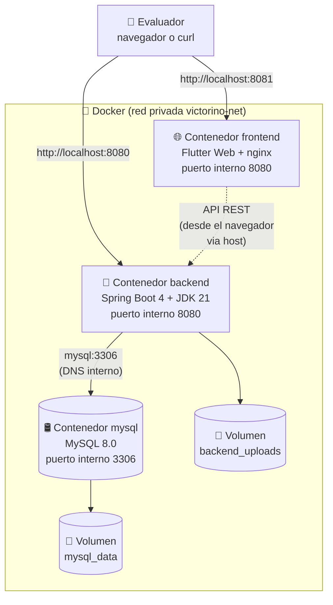

# Guía para reproducir el entorno completo del TFG y revisar el código

> **Proyecto**: Victorino Style — Gestión de citas para una peluquería
> **Autor**: Kevin (KevinFlow-ai)
> **TFG**: 2DAM, curso 2025/2026
> **Versión de la guía**: 1.0 — mayo de 2026
> **Documento complementario**: `INSTRUCCIONES.md` (versión corta de arranque rápido)

---

## ¿Por qué existe este documento?

El TFG ya está **desplegado en producción** en la nube (Railway, ver `guia-despliegue-railway.md`). Pero el tribunal y los compañeros del ciclo necesitan poder hacer dos cosas más:

1. **Revisar el código fuente** del proyecto, idealmente sin tener que pelearse con instalaciones complejas.
2. **Levantar la aplicación completa** en su propio ordenador para probarla en local, navegar por sus pantallas y verificar el funcionamiento.

El reto: el tribunal evalúa **muchos proyectos al año**, cada uno con tecnologías distintas. No es razonable pedirles que instalen JDK 21, Maven, Flutter SDK (3 GB), MySQL Server y un montón de plugins para cada TFG. Igualmente, los compañeros que quieran probar el proyecto pueden usar Windows, macOS o Linux, con ordenadores en distintos estados de configuración.

**La solución elegida es Docker Compose**: una sola herramienta gratuita y multiplataforma que encapsula todo el entorno (base de datos, backend, frontend) en contenedores. Con un único comando, la aplicación arranca igual en cualquier sistema operativo, sin contaminar el ordenador del evaluador y permitiendo borrarla limpiamente al terminar.

Esta guía explica **cómo se ha generado ese entorno reproducible, cómo se distribuye al tribunal, y cómo cualquier persona puede ejecutarlo paso a paso** aunque tenga el ordenador "limpio" y poco conocimiento técnico.

---

## Índice

1. [Apartado 1 — Cómo se ha generado el entorno](#1-apartado-1--cómo-se-ha-generado-el-entorno)
2. [Apartado 2 — Cómo se distribuye al tribunal o compañeros](#2-apartado-2--cómo-se-distribuye-al-tribunal-o-compañeros)
3. [Apartado 3 — Cómo ejecutarlo en un ordenador "limpio"](#3-apartado-3--cómo-ejecutarlo-en-un-ordenador-limpio)
   - [3.1. Windows](#31-windows-10--11)
   - [3.2. macOS](#32-macos-apple-silicon-m1m2m3-o-intel)
   - [3.3. Linux](#33-linux-ubuntu-2204-debian-12-fedora-arch)
   - [3.4. Cómo probar la app en móvil o emulador](#34-cómo-probar-la-app-en-móvil-o-emulador)
4. [Apartado 4 — Notas para el tribunal](#4-apartado-4--notas-para-el-tribunal)
5. [Apartado 5 — Preguntas frecuentes (FAQ)](#5-apartado-5--preguntas-frecuentes-faq)
6. [Anexo — Glosario rápido de términos Docker](#anexo--glosario-rápido-de-términos-docker)

---

# 1. Apartado 1 — Cómo se ha generado el entorno

## 1.1. ¿Por qué Docker y no otras opciones?

Antes de elegir Docker se valoraron varias alternativas. Esta tabla resume las opciones consideradas:

| Opción | Cómo funciona | Inconvenientes |
|---|---|---|
| **ZIP "a pelo" + instalación manual** | Se entrega el código y el evaluador instala JDK 21, Maven, Flutter SDK, MySQL Server, plugins. | 1-2 horas de instalaciones por persona. Cada SO requiere pasos distintos. Conflictos entre versiones ya instaladas. Difícil de limpiar tras evaluar. |
| **Vagrant + VirtualBox** | Se levanta una máquina virtual completa con el SO + el stack. | Mucho consumo de recursos (RAM, disco). Lentitud. Vagrant casi obsoleto desde el auge de Docker. |
| **Nix / NixOS** | Sistema declarativo de paquetes reproducibles. | Curva de aprendizaje muy alta. Muy poca gente lo usa fuera de comunidades específicas. |
| **Scripts shell de instalación** | Un `.sh` o `.bat` que instala todo. | Cada SO requiere su propio script. Frágil ante diferencias de versiones, repositorios, dependencias del sistema. |
| **Instalador nativo** (.msi, .pkg, .deb…) | Un instalador "tradicional" como cualquier software. | Hay que crear tres instaladores (uno por SO). Muy laborioso. No facilita ver el código. |
| ✅ **Docker Compose** | Encapsula la aplicación en contenedores aislados. Multiplataforma idéntico. | Hay que instalar Docker (5 min). La primera ejecución descarga ~3 GB de imágenes base. |

**Docker Compose es el estándar de la industria** desde 2014 para distribuir entornos de desarrollo y demostraciones de software complejo. Es lo que usan empresas para que un nuevo desarrollador pueda empezar a trabajar el primer día sin pasarse una semana configurando su máquina. Para un TFG es la elección **profesional, eficiente y multiplataforma**.

## 1.2. Arquitectura del entorno containerizado

El sistema completo se levanta como tres contenedores Docker conectados entre sí en una red privada virtual:



Conceptos clave:

- **Red privada virtual** (`victorino-net`): los tres contenedores comparten una red interna donde se ven entre sí por **nombre de servicio** gracias al DNS automático de Docker. El backend resuelve `mysql` y conecta directamente; no necesita saber IPs.
- **Puertos expuestos al host**: solo el `backend` y el `frontend` exponen puertos al ordenador del evaluador (`8080` y `8081` respectivamente). El MySQL también expone el 3306 para que el evaluador pueda inspeccionar la BD con Workbench si lo desea, pero **no es obligatorio**.
- **Volúmenes persistentes**: dos discos virtuales gestionados por Docker que sobreviven a `docker compose down` (mientras no se use `-v`). `mysql_data` contiene los datos de la BD; `backend_uploads` contiene las fotos subidas en runtime.
- **El frontend, desde el navegador, llama al backend vía `localhost:8080`**: no via la red interna de Docker. Es importante porque el JavaScript de Flutter Web se ejecuta en el navegador del evaluador, no dentro del contenedor. El navegador no "ve" la red interna de Docker, solo el host.

## 1.3. Inventario de ficheros añadidos al repositorio

Para hacer todo esto posible se añadieron al repositorio los siguientes ficheros nuevos:

| Fichero | Ubicación | Qué hace |
|---|---|---|
| `docker-compose.yml` | Raíz del repo | Define los 3 servicios (mysql, backend, frontend), sus puertos, variables, volúmenes y dependencias |
| `Backend_Victorino/Dockerfile` | Backend | Define cómo construir la imagen del backend: stage 1 compila con Maven + JDK 21, stage 2 ejecuta con JRE alpine |
| `Backend_Victorino/.dockerignore` | Backend | Excluye `target/`, `.idea/`, `uploads/` y otros archivos del contexto de build para acelerar el proceso |
| `frontend_victorino/Dockerfile` | Frontend | Ya existía. Compila Flutter Web con `flutter build web --release` + sirve con nginx |
| `frontend_victorino/.dockerignore` | Frontend | Ya existía. Excluye `build/`, `android/`, `ios/`, etc. del contexto de build |
| `.env.example` | Raíz del repo | Plantilla con todas las variables de entorno que el evaluador rellena (contraseñas, JWT secret, credenciales Gmail y Firebase) |
| `INSTRUCCIONES.md` | Raíz del repo | Versión corta de esta guía para arrancar la app en <10 minutos |

Y **no se ha tocado** nada del código de negocio del proyecto: backend Spring Boot, frontend Flutter, schemas SQL, etc. Toda la "magia" Docker está en archivos nuevos y específicos del despliegue, sin contaminar el código principal.

## 1.4. Cómo se carga la base de datos automáticamente

La imagen oficial de MySQL ejecuta **cualquier `.sql` que encuentre en `/docker-entrypoint-initdb.d/`** la primera vez que arranca (cuando el volumen de datos está vacío). Aprovechando esto:

```yaml
# Extracto de docker-compose.yml
mysql:
  image: mysql:8.0
  volumes:
    - mysql_data:/var/lib/mysql
    - ./Backend_Victorino/src/main/resources/db/schema_railway.sql:/docker-entrypoint-initdb.d/01-schema.sql:ro
    - ./Backend_Victorino/src/main/resources/db/seed_railway.sql:/docker-entrypoint-initdb.d/02-seed.sql:ro
```

Cuando el evaluador hace `docker compose up --build` por primera vez:
1. MySQL se inicia.
2. Detecta que `/var/lib/mysql` está vacío → es el "primer arranque".
3. Ejecuta los scripts montados en `/docker-entrypoint-initdb.d/` **en orden alfabético**: primero `01-schema.sql` (crea las 15 tablas), luego `02-seed.sql` (carga 53 usuarios + ~1000 citas + 4 servicios + 15 festivos).
4. A partir de ahí, la BD persiste en el volumen `mysql_data`.

Si más adelante se hace `docker compose down -v` (con `-v`), el volumen se borra y la próxima vez vuelve a ejecutar los scripts. Si solo se hace `docker compose down` (sin `-v`), los datos permanecen y los scripts ya **no se vuelven a ejecutar** (porque el directorio no está vacío).

## 1.5. Cómo se hornea la URL del backend en el frontend

Flutter Web compila a **JavaScript estático**, así que no puede leer variables de entorno en runtime como hace el backend. Por eso la URL del backend se "hornea" en el bundle JS durante la compilación:

```dockerfile
# Extracto de frontend_victorino/Dockerfile
ARG API_BASE_URL=http://localhost:8080/api/v1
RUN flutter build web --release \
    --dart-define=API_BASE_URL=${API_BASE_URL}
```

Y en `docker-compose.yml`:
```yaml
frontend:
  build:
    context: ./frontend_victorino
    args:
      API_BASE_URL: "http://localhost:8080/api/v1"
```

Cuando el evaluador hace `docker compose up --build`, Docker pasa `API_BASE_URL=http://localhost:8080/api/v1` como **build argument** al Dockerfile del frontend. Flutter lo recibe via `--dart-define` y lo embebe en el bundle JS final como una constante. El código Dart la lee con:

```dart
const String apiBaseUrl = String.fromEnvironment(
  'API_BASE_URL',
  defaultValue: 'http://10.0.2.2:8080/api/v1',
);
```

Resultado: el bundle JS final tiene "horneado" que la URL del backend es `http://localhost:8080/api/v1`. Cuando el evaluador abre `http://localhost:8081`, el JS se descarga al navegador y ya sabe a qué URL apuntar.

## 1.6. Por qué esta solución es profesional

Resumen de por qué Docker Compose es la elección correcta para este TFG:

1. **Estándar de la industria**: Docker es la tecnología más usada para distribuir software desde 2014. Empresas como Google, Netflix, Spotify, etc., distribuyen entornos así.
2. **Multiplataforma idéntico**: el mismo `docker-compose.yml` funciona en Windows, macOS y Linux sin cambios.
3. **Aislamiento total**: nada se instala en el sistema del evaluador. Los contenedores viven en su propio espacio y no contaminan nada.
4. **Reproducibilidad garantizada**: las imágenes base están versionadas (`mysql:8.0`, `eclipse-temurin:21-jre-alpine`, `nginx:alpine`). Mismo input → mismo output.
5. **Autodocumentado**: el `docker-compose.yml` describe declarativamente toda la arquitectura del proyecto en ~120 líneas. Un desarrollador puede entender el sistema entero leyéndolo.
6. **Limpieza trivial**: `docker compose down -v` borra todo. El sistema queda exactamente como antes.
7. **No requiere IDEs pesados**: el evaluador puede usar Notepad, VSCode, IntelliJ Community gratis… cualquier editor de texto sirve para inspeccionar el código.

---

# 2. Apartado 2 — Cómo se distribuye al tribunal o compañeros

## 2.1. Estrategia de entrega

El código se entrega por **dos vías complementarias**:

**Vía A — ZIP descargable vía Google Drive (canal principal)**
- Se genera un `victorino-style-tfg.zip` con todo el contenido del repositorio.
- Se sube a Google Drive con permiso "Cualquiera con el enlace puede ver, descargar".
- Se comparte el enlace con el tribunal y los compañeros.
- Tamaño aproximado: 200-300 MB (incluye `assets/imagenes/` con varias fotos).

**Vía B — Repositorio GitHub privado (acceso bajo demanda)**
- El repositorio sigue privado en GitHub porque el historial contiene secretos (decisión consciente del autor, ver guía Railway).
- Si algún profesor lo solicita expresamente, se le añade como **colaborador** del repo para que pueda navegar el código en la web o hacer `git clone`.
- Útil sobre todo para los profesores que quieran ver el **historial completo** de commits, no solo la versión final.

## 2.2. Generación del ZIP

El ZIP se genera de forma controlada **excluyendo** los archivos que no deben llegar al evaluador:

| Excluir | Motivo |
|---|---|
| `.git/` | Historial completo del repo: pesado e incluye secretos antiguos |
| `**/target/` | Outputs de Maven (se regenerarán en Docker) |
| `**/build/` | Outputs de Flutter |
| `**/.dart_tool/` | Cache de Dart |
| `**/node_modules/` | Si existiera |
| `**/.idea/` | Config de IntelliJ del autor |
| `**/.gradle/` | Cache de Gradle Android |
| `**/.kiro/`, `**/.agents/` | Carpetas internas de desarrollo |
| `.env` (sin extensión) | El `.env` real con credenciales del autor (si existiera localmente) |

Comando PowerShell de referencia para generarlo:

```powershell
# Desde la carpeta padre del repositorio
$exclude = @('.git', 'target', 'build', '.dart_tool', '.idea', '.gradle', '.kiro', '.agents', 'node_modules', '.env')
Compress-Archive -Path Victorino_Style -DestinationPath victorino-style-tfg.zip -CompressionLevel Optimal
```

(En la práctica, lo más fácil es eliminar manualmente esas carpetas tras clonar y luego comprimir).

## 2.3. Distribución del `.env` con credenciales

Como en este TFG las credenciales reales (Gmail app password, Firebase service account, JWT secret) son **obligatorias** para que la app funcione completamente, hay dos opciones:

- **Opción 1 (recomendada)**: enviar al tribunal un **correo aparte** con un `.env` ya pre-rellenado adjuntado. El evaluador solo tiene que descargarlo, pegarlo en la carpeta del proyecto y arrancar. Cero configuración.
- **Opción 2**: enviar las credenciales sueltas (app password, JSON Firebase) en el correo, junto con el enlace al ZIP. El evaluador las pega manualmente en `.env`.

En cualquier caso, el `.env.example` versionado en el repo lleva placeholders claros (`CAMBIAR_ESTO_POR_APP_PASSWORD_GMAIL`, etc.) para que se vea fácilmente qué hay que rellenar.

## 2.4. Estructura del ZIP recibido (qué ve el evaluador)

Al descomprimir el ZIP, el evaluador encuentra:

```
victorino-style-tfg/
├── INSTRUCCIONES.md                ← Empezar leyendo esto
├── docker-compose.yml              ← Configuración Docker (no tocar)
├── .env.example                    ← Plantilla de credenciales
├── README.md                       ← Descripción general del proyecto
├── Backend_Victorino/              ← Backend Spring Boot
│   ├── Dockerfile
│   ├── pom.xml
│   └── src/
│       └── main/
│           ├── java/               ← Código fuente Java
│           ├── resources/
│           │   ├── application.properties
│           │   ├── db/             ← SQL schema + seed
│           │   └── uploads-seed/   ← Fotos iniciales
│           └── ...
├── frontend_victorino/             ← Frontend Flutter
│   ├── Dockerfile
│   ├── pubspec.yaml
│   ├── lib/                        ← Código Dart
│   ├── assets/                     ← Imágenes y logos
│   └── ...
└── documentacion/                  ← Memoria, guías, diagramas
    ├── guia-distribucion-codigo.md ← Este archivo
    ├── guia-despliegue-railway.md  ← Guía del despliegue en la nube
    ├── administrador/
    ├── auth/
    ├── cliente/
    └── errores.md
```

**El evaluador empieza por `INSTRUCCIONES.md`** y, si quiere más detalle, salta a `documentacion/guia-distribucion-codigo.md` (este documento).

## 2.5. Versionado y trazabilidad

Cada entrega del ZIP corresponde a un **tag de Git** en el repositorio:

- `tfg-defensa-v1.0` — versión inicial entregada al tribunal.
- `tfg-defensa-v1.1` — si se corrige algún bug crítico antes de la defensa.

Así se garantiza que aunque Kevin siga commitando después, el evaluador siempre puede saber exactamente qué versión está probando.

---

# 3. Apartado 3 — Cómo ejecutarlo en un ordenador "limpio"

Esta sección asume que el evaluador parte de un ordenador **prácticamente recién salido de fábrica**, sin Docker, sin Git, sin nada del stack del proyecto. Los pasos están descritos como si fueran para alguien sin experiencia en programación, con cada acción enumerada y verificada.

> 💡 **Lo más importante**: el único programa que tienes que instalar es **Docker Desktop** (en Windows/macOS) o **Docker Engine** (en Linux). Todo lo demás corre **dentro** de los contenedores. No vas a tener que instalar Java, Maven, Flutter SDK ni MySQL Server.

---

## 3.1. Windows (10 / 11)

### 3.1.1. Verificar requisitos

Tu Windows debe ser:
- **Windows 10 build 19041 o superior** (cualquier Windows 10 actualizado).
- **Windows 11** (cualquier versión).
- **Virtualización activada en BIOS**. Esto suele estar activado por defecto. Para comprobarlo:
  - Pulsa `Ctrl + Shift + Esc` → Administrador de tareas → pestaña **Rendimiento** → CPU.
  - Abajo a la derecha debe poner **"Virtualización: Habilitada"**.
  - Si pone "Deshabilitada": hay que entrar en la BIOS (al arrancar el PC, normalmente pulsando F2 o Suprimir) y activar "Intel VT-x" o "AMD-V". Si esto te suena complicado, pide ayuda a alguien con experiencia o sáltate este TFG en Docker y prueba solo la versión web desplegada en Railway (URL en la guía Railway).

### 3.1.2. Instalar Docker Desktop

1. Abre tu navegador.
2. Busca "Docker Desktop Windows" en Google y entra en el primer resultado oficial (`docker.com`).
3. Pulsa **"Download for Windows"** y descarga el instalador (`Docker Desktop Installer.exe`, ~600 MB).
4. Doble clic en el instalador descargado.
5. En el asistente, deja todas las opciones por defecto, especialmente **"Use WSL 2 instead of Hyper-V"** marcado.
6. Pulsa **Ok** y espera (~5 minutos).
7. Al terminar, te pedirá **reiniciar el ordenador**. Hazlo.
8. Tras reiniciar, abre **Docker Desktop** desde el menú Inicio.
9. Acepta los términos de servicio.
10. **Espera** a que la barra inferior izquierda ponga "**Engine running**" en verde. Puede tardar 30-60 segundos.

> 📌 **¿Ya tienes Docker Desktop instalado?** Sáltate todo este paso.

### 3.1.3. (Opcional) Instalar 7-Zip

Si tu Windows no descomprime archivos ZIP grandes correctamente, instala **7-Zip** desde su web oficial (gratis). Para los ZIP normales el descompresor de Windows basta.

### 3.1.4. Descargar el código

1. Abre el enlace de Google Drive que Kevin te haya pasado.
2. Pulsa el botón **Descargar** (icono ⬇ arriba a la derecha de la pantalla de Drive).
3. Si Drive avisa "El archivo es grande, ¿descargar de todas formas?" → **Sí**.
4. Espera a que termine la descarga (`victorino-style-tfg.zip`, ~250 MB).

### 3.1.5. Descomprimir en una carpeta corta

**Importante**: extrae el ZIP en una carpeta con **ruta corta y sin espacios**, por ejemplo `C:\victorino\`. Si lo extraes en `C:\Users\Tu Nombre\Downloads\victorino-style-tfg\`, Docker puede dar problemas con rutas largas o con espacios.

1. Clic derecho sobre `victorino-style-tfg.zip` → **Extraer todo…**
2. En "Destino", escribe `C:\victorino` y pulsa **Extraer**.

### 3.1.6. Abrir PowerShell en esa carpeta

1. Abre el Explorador de archivos.
2. Navega a `C:\victorino\victorino-style-tfg\` (o donde hayas extraído).
3. En la barra de direcciones de arriba, **escribe `powershell` y pulsa Enter**.
4. Se abrirá una ventana azul con texto blanco (PowerShell), ya posicionada en esa carpeta.

### 3.1.7. Configurar credenciales

Kevin te ha enviado por correo aparte un fichero `.env` ya rellenado, o las credenciales sueltas.

**Opción A — Tienes el `.env` ya rellenado**:
Simplemente arrástralo desde la descarga al Explorador, dentro de la carpeta del proyecto. Sustituye al `.env.example` (que sigue ahí también).

**Opción B — Tienes las credenciales sueltas**:
1. En PowerShell ejecuta:
   ```powershell
   Copy-Item .env.example .env
   notepad .env
   ```
2. Se abre el Notepad con el contenido.
3. Sustituye los placeholders `CAMBIAR_ESTO_...` por los valores reales que te haya pasado Kevin.
4. Guarda con Ctrl+S y cierra el Notepad.

### 3.1.8. Arrancar todo

En la misma ventana de PowerShell, ejecuta:

```powershell
docker compose up --build
```

**La primera vez tarda 20-30 minutos**. Verás muchísimos logs por la pantalla. Lo que va pasando, por orden:

1. Docker descarga la imagen `mysql:8.0` (~500 MB).
2. Docker descarga la imagen `maven:3.9-eclipse-temurin-21` (~700 MB).
3. Docker descarga la imagen `eclipse-temurin:21-jre-alpine` (~80 MB).
4. Docker descarga la imagen `ghcr.io/cirruslabs/flutter:3.41.2` (~3 GB).
5. Maven compila el backend (~2 min).
6. Flutter compila el frontend Web (~1 min).
7. MySQL arranca y ejecuta el schema + seed automáticamente.
8. El backend arranca, copia las fotos seed al volumen, inicializa Firebase.
9. Nginx arranca sirviendo el frontend.

Cuando todo esté listo, verás en los logs:
```
victorino-backend  | Started BackendVictorinoApplication in X seconds
victorino-frontend | Starting Container
```

**No cierres la ventana de PowerShell** mientras quieras que la app esté funcionando.

### 3.1.9. Probar que funciona

Abre tu navegador (Chrome, Edge, Firefox) en:
```
http://localhost:8081
```

Verás la pantalla de login de Victorino Style con su logo. Si la ves, **¡todo funciona!** Si no carga, espera 30 segundos más (a veces nginx tarda en estabilizarse) y refresca.

También puedes probar el backend directamente abriendo:
```
http://localhost:8080/api/v1/swagger-ui.html
```

Verás Swagger UI con la lista de endpoints del API.

### 3.1.10. Hacer login

En la pantalla de login del frontend, usa una de estas credenciales:

| Rol | Correo | Contraseña |
|---|---|---|
| **Administrador** (todas las funciones) | `victorino@admin.com` | `Admin1234!` |
| **Empleado** (vista de peluquero) | `maradona@victorinostyle.com` | `Empleado1234!` |
| **Empleado** (segundo peluquero) | `jerson@victorinostyle.com` | `Empleado1234!` |
| **Cliente demo 1** | `andres.lozano@gmail.com` | `Cliente1234!` |
| **Cliente demo 2** | `carlos.rodriguez@gmail.com` | `Cliente1234!` |

Tras hacer login verás el panel correspondiente al rol. Como administrador, ves citas, empleados, servicios, métricas, etc.

### 3.1.11. Detener la app

Cuando termines de evaluar, en la ventana de PowerShell:
1. Pulsa **`Ctrl + C`**. La app se detiene en ~10 segundos.
2. Ejecuta `docker compose down` para liberar los contenedores. **Los datos se conservan** (el volumen `mysql_data` sigue ahí).

### 3.1.12. Borrar absolutamente todo

Si quieres que tu PC quede como antes de evaluar:

```powershell
docker compose down -v
```

Esto borra los contenedores, las redes y los **volúmenes** (incluida la BD). Tu disco recupera ese espacio.

Si además quieres eliminar las imágenes Docker descargadas (5+ GB):
```powershell
docker image prune -a -f
```

### 3.1.13. Problemas comunes en Windows

| Síntoma | Solución |
|---|---|
| `error during connect: ... is the Docker daemon running?` | Abre Docker Desktop y espera a "Engine running" |
| `WSL 2 installation is incomplete` | Sigue las instrucciones en pantalla de Docker Desktop o ejecuta `wsl --install` en PowerShell |
| `Bind for 0.0.0.0:8080 failed: port is already allocated` | Algún programa está usando ese puerto. Detenlo o edita `docker-compose.yml` y cambia `8080:8080` a `9080:8080` (luego accede en `http://localhost:9080`) |
| Docker Desktop dice "Hardware assisted virtualization is not enabled" | Reinicia y entra en la BIOS a activar Intel VT-x / AMD-V |
| Build tarda más de 45 minutos | Tu conexión a internet es lenta. Sé paciente; las imágenes son grandes |

---

## 3.2. macOS (Apple Silicon M1/M2/M3 o Intel)

### 3.2.1. Verificar requisitos

- **macOS 12 Monterey** o superior (para Docker Desktop 4.x).
- Mínimo **4 GB de RAM** disponible para Docker (recomendado 8 GB).
- ~8 GB libres en disco.

### 3.2.2. Instalar Docker Desktop

1. Abre Safari o tu navegador.
2. Busca "Docker Desktop Mac" → entra en `docker.com`.
3. Descarga la versión correcta:
   - Si tu Mac tiene chip **M1, M2, M3 o M4** → **Apple Silicon**.
   - Si tu Mac es **Intel** (2020 o anterior) → **Intel chip**.
   - Si no sabes cuál tienes: menú Apple () → "Acerca de este Mac" → mira "Chip".
4. Abre el `.dmg` descargado.
5. Arrastra el icono de Docker a la carpeta **Aplicaciones**.
6. Abre **Launchpad** → busca "Docker" → ábrelo.
7. macOS pedirá permiso "Docker.app es una aplicación descargada de internet" → **Abrir**.
8. Acepta los términos y los permisos solicitados.
9. Espera a que el icono de Docker en la barra superior deje de animarse: **Docker está corriendo**.

> 📌 **¿Ya tienes Docker?** Sáltate este paso.

### 3.2.3. Abrir Terminal

1. Pulsa **`Cmd + Espacio`** → escribe "Terminal" → Enter.

### 3.2.4. Descargar y descomprimir el código

1. Abre el enlace de Google Drive en Safari.
2. Pulsa **Descargar**. El ZIP llega a `~/Downloads/victorino-style-tfg.zip`.
3. Doble clic sobre el ZIP. macOS lo descomprime solo a `~/Downloads/victorino-style-tfg/`.
4. (Opcional) mueve la carpeta a un sitio más cómodo: `mv ~/Downloads/victorino-style-tfg ~/victorino`.

### 3.2.5. Configurar credenciales

En Terminal:
```bash
cd ~/Downloads/victorino-style-tfg     # o donde hayas movido la carpeta
cp .env.example .env
nano .env
```

Edita los valores que toque. Para guardar en nano: **`Ctrl + O`** → Enter → **`Ctrl + X`**.

(Si Kevin te ha pasado un `.env` ya rellenado, simplemente cópialo a la carpeta con `cp ~/Downloads/.env .env`).

### 3.2.6. Arrancar

```bash
docker compose up --build
```

Igual que en Windows: 20-30 minutos la primera vez. Verás logs por la pantalla.

### 3.2.7. Probar

Abre Safari (o el navegador que prefieras) en:
```
http://localhost:8081
```

Login con `victorino@admin.com` / `Admin1234!`.

### 3.2.8. Detener / limpiar

- Para parar: **`Ctrl + C`** en la Terminal, luego `docker compose down`.
- Para borrar todo: `docker compose down -v`.

### 3.2.9. Problemas comunes en macOS

| Síntoma | Solución |
|---|---|
| `Cannot connect to the Docker daemon` | Abre la app Docker Desktop |
| Docker dice "Resource limits exceeded" | Ve a Docker Desktop → Settings → Resources → sube la RAM asignada a 6 GB |
| Performance lenta en Mac Intel antiguo | Macs Intel <= 2018 pueden ir lentos con Docker. Sé paciente |
| Build falla en chip M1/M2 con "no matching manifest for linux/arm64" | Edita el `docker-compose.yml` y añade `platform: linux/amd64` a cada servicio. Reintenta |

---

## 3.3. Linux (Ubuntu 22.04+, Debian 12+, Fedora, Arch)

En Linux **no se usa Docker Desktop**; se instala el motor Docker directamente.

### 3.3.1. Instalar Docker Engine

Para **Ubuntu/Debian** (los más comunes), copia y pega en una terminal:

```bash
# 1. Actualiza el sistema
sudo apt update
sudo apt install -y ca-certificates curl gnupg

# 2. Añade el repositorio oficial de Docker
sudo install -m 0755 -d /etc/apt/keyrings
curl -fsSL https://download.docker.com/linux/ubuntu/gpg | sudo gpg --dearmor -o /etc/apt/keyrings/docker.gpg
sudo chmod a+r /etc/apt/keyrings/docker.gpg
echo "deb [arch=$(dpkg --print-architecture) signed-by=/etc/apt/keyrings/docker.gpg] https://download.docker.com/linux/ubuntu $(. /etc/os-release && echo "$VERSION_CODENAME") stable" | sudo tee /etc/apt/sources.list.d/docker.list > /dev/null

# 3. Instala Docker
sudo apt update
sudo apt install -y docker-ce docker-ce-cli containerd.io docker-compose-plugin

# 4. Añade tu usuario al grupo docker (para no usar sudo en cada comando)
sudo usermod -aG docker $USER
newgrp docker

# 5. Verifica
docker --version
docker compose version
```

Para **Fedora** o **Arch** los pasos son distintos pero conceptualmente idénticos. Consulta la documentación oficial de Docker para tu distribución.

> 📌 **¿Ya tienes Docker?** Sáltate este paso. Comprueba con `docker --version`.

### 3.3.2. Descargar y descomprimir

```bash
cd ~
# Descarga el ZIP desde el enlace de Drive (con tu navegador o con wget si Kevin te dio enlace directo)
unzip victorino-style-tfg.zip
cd victorino-style-tfg
```

### 3.3.3. Configurar credenciales

```bash
cp .env.example .env
nano .env       # o vim, gedit, kate, etc.
```

### 3.3.4. Arrancar

```bash
docker compose up --build
```

### 3.3.5. Probar

Abre tu navegador en `http://localhost:8081`. Login con `victorino@admin.com` / `Admin1234!`.

### 3.3.6. Detener / limpiar

```bash
# Ctrl+C en la terminal donde corre docker compose
docker compose down       # conserva datos
docker compose down -v    # borra todo
```

### 3.3.7. Problemas comunes en Linux

| Síntoma | Solución |
|---|---|
| `permission denied while trying to connect to the Docker daemon socket` | Olvidaste el paso `usermod -aG docker $USER && newgrp docker`. Hazlo ahora. O cierra sesión y vuelve a entrar |
| `Cannot connect to MySQL` durante el seed | El healthcheck del MySQL aún no había pasado. Detén con Ctrl+C y vuelve a lanzar `docker compose up` (sin `--build` esta vez) |
| Build muy lento en Linux con SSD lento | Sé paciente. Linux con HDD puede llegar a tardar 45 min |

---

## 3.4. Cómo probar la app en móvil o emulador

El compose levanta el **frontend web** (lo que el evaluador ve en `http://localhost:8081`). Esta es la forma más rápida de evaluar la aplicación. Pero si se quiere probar también en **móvil real** o un **emulador**, hay varias rutas, ordenadas de menos a más esfuerzo:

### 3.4.1. Opción A (la más simple, recomendada): APK ya generado contra el backend de Railway

El TFG incluye una versión **móvil Android** ya generada y subida a Google Drive. Apunta al backend de producción (Railway), **no necesita Docker en absoluto**.

1. Descarga `app-release.apk` desde el enlace de Drive (consultar `documentacion/guia-despliegue-railway.md`, sección 10).
2. Cópialo a tu móvil Android (Bluetooth, USB, Telegram a ti mismo, etc.).
3. Permite "instalar de fuentes desconocidas" la primera vez que abras el APK.
4. Instala y abre la app. Pantalla de login.
5. Login con las credenciales habituales.

Esta es la forma **más fácil y rápida** para el tribunal probar la app móvil real. No requiere ni Docker, ni emulador, ni configuración alguna.

### 3.4.2. Opción B: APK contra TU propio Docker local (más experimental)

La aplicación Flutter incluye una pantalla **"Ajustes del servidor"** desde la pantalla de login (icono ⚙ esquina inferior). Permite cambiar la URL del backend en tiempo de ejecución, sin recompilar.

Pasos para usarla:

1. Levanta el compose como en la sección 3.1, 3.2 o 3.3.
2. Encuentra la IP local de tu PC en la red WiFi:
   - **Windows**: `ipconfig` → busca `IPv4 Address` (algo tipo `192.168.1.42`).
   - **macOS**: `ipconfig getifaddr en0` (WiFi) o `ipconfig getifaddr en1`.
   - **Linux**: `ip addr show | grep inet` → busca tu interfaz WiFi.
3. Asegúrate de que **tu PC y tu móvil están en la misma red WiFi**.
4. Permite el puerto 8080 en el firewall de tu sistema (Windows Defender, Little Snitch, ufw…). Docker Desktop suele pedirlo la primera vez automáticamente.
5. Instala el APK (descargado del Drive) en tu Android.
6. Al abrir el APK, en la pantalla de login pulsa el icono ⚙ "Ajustes del servidor".
7. Cambia la URL a `http://192.168.1.42:8080/api/v1` (sustituye `192.168.1.42` por la IP que viste en el paso 2).
8. Guarda. Vuelve atrás y haz login.

Ahora el APK habla con tu backend Docker local. **Importante**: si cierras Docker en tu PC, el APK perderá conexión.

### 3.4.3. Opción C: Emulador Android (no recomendado para tribunal)

Levantar un emulador Android es **pesado** (~10 GB de Android SDK + sistema de imágenes). Aunque existen imágenes Docker tipo `budtmo/docker-android` que arrancan un emulador con interfaz por navegador (VNC), no es práctico para una evaluación rápida del TFG.

**Alternativa práctica**: usar el navegador en modo "móvil emulado":
1. Abre `http://localhost:8081` en Chrome o Edge.
2. Pulsa **F12** (DevTools) → icono "Toggle device toolbar" (Ctrl+Shift+M).
3. Selecciona un dispositivo (iPhone 14 Pro Max, Galaxy S24, etc.).
4. El frontend se muestra como en un móvil. Es una simulación visual; el funcionamiento es idéntico al real.

Para 95% de los casos de evaluación, esta opción cubre la "experiencia móvil" sin necesidad de instalar nada extra.

### 3.4.4. Opción D: iOS (iPhone / iPad)

**No disponible** en el TFG (requiere Mac + cuenta Apple Developer, ver guía Railway sección 11). Si algún miembro del tribunal usa iPhone, lo más realista es:
1. Abrir Safari en su iPhone.
2. Ir a la URL del frontend web desplegado en Railway (ver guía Railway).
3. Funciona como una app porque Flutter Web es responsive.

---

# 4. Apartado 4 — Notas para el tribunal

Esta sección recopila los argumentos clave para entender por qué esta forma de distribución es **profesional y eficiente** para evaluar un TFG. Útil tanto para el evaluador como para el autor (Kevin) al defender la decisión.

1. **Docker es el estándar de la industria** para distribuir software desde 2014. Empresas como Google, Netflix, Spotify, Amazon, etc. distribuyen entornos así. No es algo "novedoso" o "experimental": es lo que un desarrollador profesional usa cada día.

2. **No necesitas instalar nada del stack del proyecto**: Java, Maven, Flutter SDK, MySQL Server… todo va dentro de los contenedores. Tu ordenador queda limpio.

3. **Funciona exactamente igual en Windows, macOS y Linux**. El mismo `docker-compose.yml`, los mismos comandos, el mismo resultado.

4. **Aislamiento total**: lo que se ejecuta en los contenedores no afecta a tu sistema. No hay riesgo de "esto me ha roto algo".

5. **Limpieza trivial**: con `docker compose down -v` desaparece todo. Tu sistema queda exactamente como antes de evaluar este TFG. Sin huellas.

6. **Primer arranque lento (20-30 min) pero los siguientes son instantáneos (~1 min)**. Esto es porque Docker descarga las imágenes base (JDK 21, Flutter SDK, MySQL…) la primera vez y luego las cachea localmente.

7. **Si solo quieres ver el código sin ejecutarlo**: abre el ZIP con cualquier editor de texto. Hasta el Notepad básico de Windows sirve. Recomendado: VSCode (gratis) o IntelliJ Community (gratis).

8. **Reproducibilidad garantizada**: las imágenes base están versionadas (`mysql:8.0`, `eclipse-temurin:21`, `flutter:3.41.2`). Si dentro de 2 años quieres reproducir esto, funcionará exactamente igual.

9. **Comparativa de tiempos**:
   - Distribución "tradicional" (ZIP + instala JDK + Maven + Flutter + MySQL + configura todo): **1-2 horas** y muchos pasos manuales propensos a error.
   - Distribución con Docker: **5 minutos de instalación + 30 minutos de espera automática** sin tocar nada.

10. **Si no quieres Docker**, el ZIP también es el código fuente directamente navegable. Puedes leer cualquier archivo sin ejecutar nada.

---

# 5. Apartado 5 — Preguntas frecuentes (FAQ)

Preguntas y respuestas anticipadas para el tribunal y compañeros.

**P: ¿Qué es Docker exactamente? ¿Y un contenedor?**
R: Docker es una tecnología que permite empaquetar una aplicación junto con todo lo que necesita (sistema operativo mínimo, librerías, configuración) en una "caja" llamada **contenedor**. Esa caja se ejecuta de forma idéntica en cualquier máquina que tenga Docker, sin importar qué sistema operativo use el host. Es como una "máquina virtual" pero mucho más ligera y rápida.

**P: ¿Por qué no me pasaste un .zip simple con instrucciones de instalación manual?**
R: Porque tardarías 1-2 horas en instalar todo el stack (Java, Maven, Flutter, MySQL) y configurarlo, y cada pequeña diferencia con mi máquina podría hacer que algo no funcionase. Con Docker, las instrucciones manuales son 3 comandos y todo funciona idéntico.

**P: ¿Cuánto ocupa Docker Desktop en mi disco?**
R: La aplicación Docker Desktop en sí ocupa ~1 GB. Las imágenes que descarga para este proyecto suman ~4-5 GB más (MySQL, JDK 21 con Maven, Flutter SDK, nginx). Total ~6 GB. Se libera todo con `docker image prune -a -f` cuando termines de evaluar.

**P: ¿Necesito permisos de administrador para instalar Docker?**
R: **Sí, en Windows y macOS**. El instalador requiere derechos de administrador. En **Linux**, también para añadir tu usuario al grupo `docker`. Si trabajas en una máquina corporativa, contacta con TI primero.

**P: ¿Es seguro ejecutar contenedores Docker?**
R: Sí, Docker está diseñado precisamente para aislar lo que ejecutas. Los contenedores no tienen acceso a tu sistema de archivos ni a tus credenciales personales por defecto. Aún así, **solo ejecutes contenedores de fuentes que conozcas** (como este TFG). Los volúmenes y puertos que se exponen están explícitamente declarados en `docker-compose.yml` para que puedas auditarlos.

**P: ¿Funciona offline tras la primera descarga?**
R: Sí. Una vez Docker ha descargado las imágenes y compilado el código (primera ejecución de `docker compose up --build`), puedes desconectar de internet y la app funciona perfectamente. Solo el envío de correos (Gmail SMTP) y push (Firebase) requieren internet, pero el resto (login, citas, navegar, BD) funciona offline.

**P: ¿Puedo usar Podman o Rancher Desktop en lugar de Docker Desktop?**
R: Sí, ambos son compatibles con `docker-compose`. **Podman** es una alternativa de código abierto y gratis. **Rancher Desktop** es similar a Docker Desktop. Funcionan igual con los mismos comandos. Si tu organización tiene restricciones con Docker Desktop (licencia comercial para empresas grandes), Podman es la alternativa estándar.

**P: ¿Y si Docker me da error con WSL2 en Windows?**
R: WSL2 (Windows Subsystem for Linux 2) es lo que Docker Desktop usa internamente. Si te da error:
1. Abre PowerShell como administrador.
2. Ejecuta `wsl --install` (instala WSL2 si no estaba).
3. Reinicia.
4. Abre Docker Desktop de nuevo.

Si persiste, busca "WSL2 backend Docker Desktop troubleshooting" en Google.

**P: ¿Cómo veo los logs si algo falla?**
R: En la terminal donde lanzaste `docker compose up`, los logs aparecen en vivo. Si lanzaste con `-d` (detached), úsalos así:
```bash
docker compose logs -f          # todos los servicios
docker compose logs -f backend  # solo el backend
docker compose logs -f mysql    # solo MySQL
```

**P: ¿Cómo accedo a la base de datos para inspeccionar tablas?**
R: El puerto 3306 está expuesto al host. Abre MySQL Workbench (o cualquier cliente MySQL como DBeaver, HeidiSQL, TablePlus) y conecta con:
- **Host**: `127.0.0.1`
- **Puerto**: `3306`
- **Usuario**: `root`
- **Contraseña**: la que pusiste en `MYSQL_ROOT_PASSWORD` del `.env`
- **Schema**: `railway`

**P: ¿Y si me dice "port 8080 already in use" o similar?**
R: Significa que otro programa ya está usando ese puerto. Dos opciones:
1. Detener el programa que lo usa.
2. Cambiar el puerto en `docker-compose.yml`: edita `"8080:8080"` a `"9080:8080"` (el primer número es el del host, el segundo el del contenedor). Luego accede en `http://localhost:9080`. Lo mismo para el frontend (`"8081:8080"`).

**P: ¿Cómo paro la app sin borrar los datos?**
R: `Ctrl+C` en la terminal de `docker compose up`, luego `docker compose down`. Los volúmenes (`mysql_data`, `backend_uploads`) se conservan. La próxima vez que hagas `docker compose up` arrancará con todos los datos intactos.

**P: ¿Cómo borro absolutamente todo cuando termine?**
R:
```bash
docker compose down -v                  # borra contenedores + redes + volúmenes
docker image prune -a -f                # borra las imágenes descargadas
docker system prune -a -f --volumes     # nuclear: limpia TODO lo de Docker
```
Luego puedes desinstalar Docker Desktop desde Panel de Control (Windows) o arrastrando a la papelera (macOS).

**P: ¿Y si quiero hacer cambios al código y ver el efecto?**
R: El `docker-compose.yml` está pensado para evaluación, no para desarrollo activo. Para cambios rápidos:
1. Edita el código en `Backend_Victorino/src/main/java/` o `frontend_victorino/lib/`.
2. Reconstruye con `docker compose up --build`. Tardará 2-5 minutos por las cachés.

Para desarrollo serio con hot reload, lo profesional es ejecutar el backend con IntelliJ y el frontend con `flutter run` directamente, sin Docker. Pero eso requiere instalar el stack completo localmente.

**P: ¿El tribunal puede ejecutar el código sin Docker, con sus herramientas nativas?**
R: Sí, pero requeriría instalar JDK 21, Maven, Flutter SDK, MySQL Server, configurar el `application.properties`, ejecutar el `schema.sql` y `seed.sql` manualmente, etc. **Lo posible pero impráctico**. Por eso ofrecemos Docker como vía principal.

**P: ¿La aplicación que veo en mi Docker local es la "misma" que la desplegada en Railway?**
R: Sí, exactamente el mismo código, las mismas tablas, los mismos seed data. La única diferencia: las URLs (en local es `localhost`, en Railway es `*.up.railway.app`) y que en local no se mandan correos a usuarios externos (Gmail puede bloquear si lo haces mucho).

**P: ¿Por qué tarda tanto la primera vez?**
R: Docker tiene que descargar:
- Imagen MySQL 8 (~500 MB)
- Imagen Maven + JDK 21 (~700 MB)
- Imagen JRE alpine (~80 MB)
- Imagen Flutter SDK (~3 GB)
- Imagen nginx alpine (~10 MB)

Más compilar el código con Maven (~2 min) y Flutter (~1 min). Total ~5 GB de descargas. Las siguientes veces todo está cacheado y arranca en ~1 min.

**P: ¿Puedo abrir el código en mi IDE (IntelliJ, VSCode) aunque no ejecute el proyecto?**
R: Por supuesto. El ZIP es el código fuente plano. Abre la carpeta `Backend_Victorino/` en IntelliJ y verás el proyecto Maven cargarse (puede que te pida bajar las dependencias para análisis estático, pero no es necesario si solo quieres leer). El frontend `frontend_victorino/` ábrelo en VSCode con la extensión de Dart/Flutter.

---

# Anexo — Glosario rápido de términos Docker

- **Imagen Docker**: plantilla inmutable con todo lo necesario para ejecutar un contenedor (sistema base, librerías, código, configuración). Comparable a un "ejecutable" pero que incluye todo el entorno.
- **Contenedor**: una instancia en ejecución de una imagen. Es como un proceso aislado del sistema host. Se puede crear, parar, borrar.
- **Dockerfile**: archivo de texto con instrucciones para construir una imagen. Como una "receta" paso a paso.
- **Docker Compose**: herramienta para orquestar **varios contenedores** que cooperan. Un archivo `docker-compose.yml` define todos los servicios y cómo se conectan.
- **Volumen**: disco virtual gestionado por Docker, persistente entre reinicios. Útil para datos que no deben perderse (BD, uploads de usuarios).
- **Red Docker**: una red virtual privada donde varios contenedores se comunican entre sí por nombre, sin pasar por internet.
- **Puerto expuesto**: cuando un contenedor "expone" un puerto al host, ese puerto del host queda redirigido al contenedor. Ej: `8080:8080` = "el puerto 8080 de mi PC va al 8080 del contenedor".
- **Registry**: servidor donde se almacenan imágenes. El público por defecto es **Docker Hub**. Imágenes como `mysql:8.0` se descargan de ahí.
- **`docker compose up`**: arranca los servicios definidos en `docker-compose.yml`. Con `--build` recompila las imágenes locales (Dockerfiles propios).
- **`docker compose down`**: detiene y elimina los contenedores. Por defecto conserva los volúmenes. Con `-v` también los borra.
- **`docker ps`**: lista los contenedores en ejecución.
- **`docker logs <contenedor>`**: muestra los logs de un contenedor concreto.

---

> Si tras leer todo esto sigue habiendo dudas, escribir a `peluqueria.victorinostyle@gmail.com` o al correo de Kevin con asunto "[TFG Victorino Style] Duda: ...". Tiempo de respuesta habitual: 24 h.
